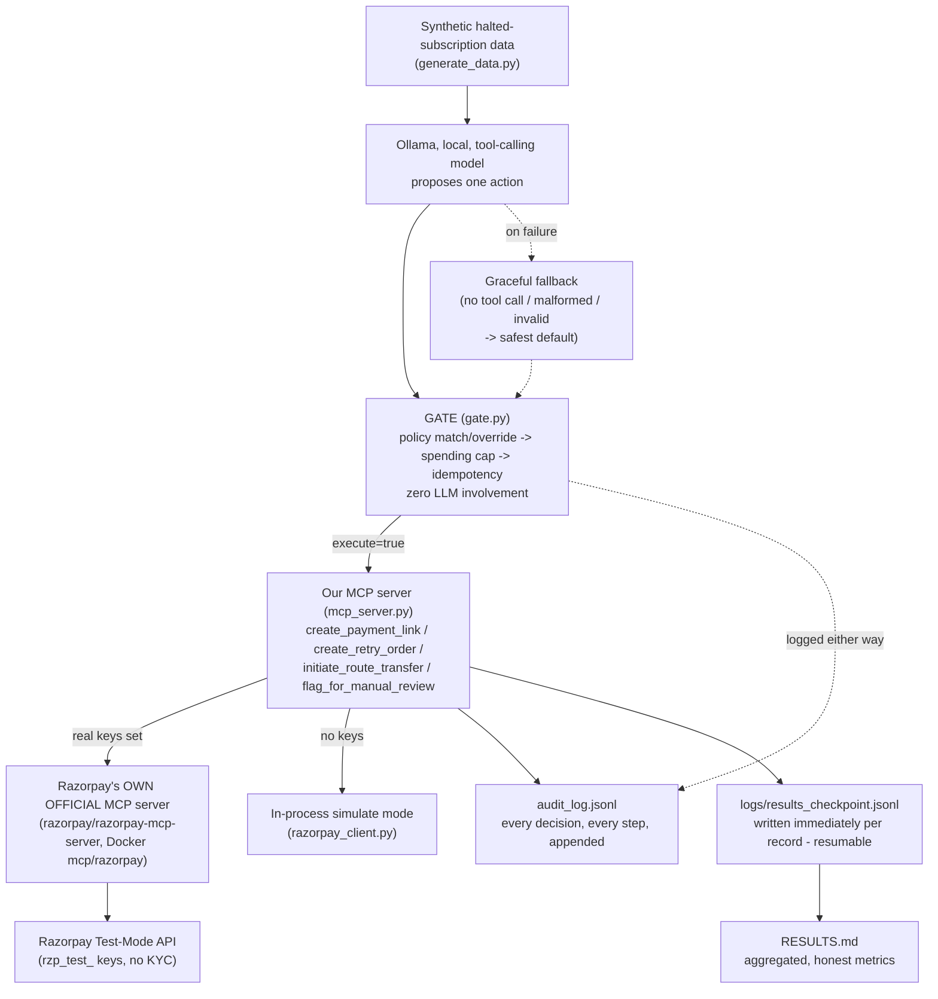

# Razorpay AI Buildathon — Build Log & Decision Record

**Project:** Subscription Recovery Agent — a bounded, gated, audited agent that picks up where Razorpay's own subscription retry engine gives up
**Track:** Track 1 — AI Growth & Agentic Commerce
**Program:** Razorpay AI Buildathon 2026 (student-only, no resume screening — you build, they call you in if it shows signal)
**Purpose of this file:** a running, append-only log. Every time we finalize a concept, algorithm, tool, or design choice, it gets written down here with the reasoning — so nothing has to be re-decided or re-explained later. Sections are added one at a time, in the order we actually worked through them. This file supersedes the earlier `PRD.md`/`DRD.md` split — everything from both now lives here, in one place, matching the structure below.

**Companion files:** `EASY_EXPLAINER.md` (plain-language walkthrough of every layer, one running example throughout) · `GLOSSARY.md` (every acronym/term, expanded — look here first if a term is unfamiliar).

---

## Table of Contents

1. [Problem Statement](#1-problem-statement) — done
   - [1.1 Relationship to Razorpay's own Subscription Recovery Agent](#11-relationship-to-razorpays-own-subscription-recovery-agent) — done
2. [Technology & Algorithm Decisions](#2-technology--algorithm-decisions) — done — *plain-language version: `EASY_EXPLAINER.md`*
3. [Architecture Design](#3-architecture-design) — done — *plain-language version: `EASY_EXPLAINER.md`*
4. [Communication Protocol Design](#4-communication-protocol-design) — done
5. [Safety Gate — Detailed Design](#5-safety-gate--detailed-design) — done
6. [Recovery Action Policy — Detailed Design](#6-recovery-action-policy--detailed-design) — done
7. [Data & Simulation Plan](#7-data--simulation-plan) — done
8. [Reporting Design](#8-reporting-design) — done
9. [Benchmarking & Results](#9-benchmarking--results) — done, real numbers from real runs
10. [Demo Script](#10-demo-script) — done
11. [Timeline & Submission](#11-timeline--submission) — done
12. [Open Questions / Risks](#12-open-questions--risks) — done
13. [Stretch: Generalizing Beyond Subscriptions](#13-stretch-generalizing-beyond-subscriptions) — done

---

## 1. Problem Statement

**Official source:** razorpay.com/buildathon/, verified 2026-08-29. Application form confirmed (Google Form: email, name, college, graduation year 2027–2029, in-person September availability). **Deadline confirmed directly by the user on the live page: 5 September 2026.**

**Background:** Razorpay runs a student-only hiring program — no resume screening. Four steps: pick a track, build something real on Razorpay's test-mode APIs, show your work (public repo, 5-minute pitch video, architecture), and if it has signal, you get called in for a ₹75,000/month, 6-or-12-month AI Builder Internship, in-person Bangalore, from September.

**The five tracks, and why Track 1:**

| Track | The trap | Why we didn't pick it |
|---|---|---|
| 2 — Risk Manager | Pure classification, no APIs, no agent, no gate | The "easy, safe, gradeable" path — explicitly rejected once the goal shifted to maximum genuine complexity |
| 3 — Revenue Recovery | Same underlying problem we're solving, but its rubric ("₹ recovered, stopping rules, audit trail") can be fully satisfied by a plain deterministic script with zero AI in it | Lower ceiling for demonstrating agent-engineering depth than Track 1's rubric |
| 4 — Finance Controller | Legitimately complex, but mostly data-matching/reconciliation with AI as an additive layer, not autonomous money-moving under guardrails | Weaker structural mirror of what Razorpay's own agent product actually does |
| 5 — Open Track | No fixed rubric to build or defend against | Highest variance, hardest to defend a scope choice in an interview |
| **1 — Agentic Commerce** ✅ | — | Rubric ("every money action explainable, bounded and gated... audit trail... one failure handled gracefully") structurally requires a real guardrail architecture — can't be faked with a shallow script. Razorpay itself shipped **Agent Studio** (built on Anthropic's Claude Agent SDK, exposed via MCP) in March 2026 — building a small, honest version of that exact pattern is the strongest available "we should hire this person" signal in the whole program. |

**Description — the track must handle (Razorpay's own framing):** "Build an agent that grows revenue for a merchant on Razorpay test-mode APIs, or that makes a merchant transactable by an AI buyer end to end." Success bar: "Every money action explainable, bounded and gated. Show the audit trail and one failure handled gracefully."

**The concrete problem we chose to solve inside that track:** Razorpay's own subscription engine auto-retries a failed recurring payment **3 times over 3 days (T+3)** — verified on razorpay.com/docs/subscriptions/payment-retries/. If all 3 fail, the subscription moves to a **halted** state and the customer is notified. Nothing tries again automatically after that. That gap — real, documented, and specific to Razorpay's actual product behavior, not a generic "payments fail sometimes" premise — is what our agent fills.

**Simple framing:** build a small AI worker that looks at subscriptions Razorpay's own system already gave up on, decides — case by case, safely — whether anything can still be done, and never gets to act outside a fixed set of rules we control.

**Complex framing:** an MCP-based agent performing bounded, gated, audited recovery actions on `halted`-state Razorpay subscriptions, using a local tool-calling LLM for proposal generation and a deterministic policy/spending-cap/idempotency gate for execution authority, with money-moving tool calls routed through Razorpay's own official MCP server when live credentials are present.

---

### 1.1 Relationship to Razorpay's own Subscription Recovery Agent

**Said plainly, up front:** Razorpay's own Agent Studio (launched at FTX'26, March 2026, built on Anthropic's Claude Agent SDK) already ships a production "Subscription Recovery Agent" as one of its four initial agents — [confirmed via Razorpay's own blog and press coverage](https://razorpay.com/agent-studio/). We knew this before finalizing scope and picked the problem anyway, deliberately — not because we think a five-day solo build can out-do a shipped product, but because rebuilding the same *pattern* Razorpay's own team chose to ship is a stronger signal of practitioner judgment than picking an adjacent, uncontested problem to avoid the comparison.

**What their production agent actually does, and where it differs from this project (sourced, not assumed):**

- **Mechanism:** their agent recovers subscriptions by placing a personalized voice call to the subscriber (English/Hindi, built on ElevenLabs), alongside smarter retry logic. This project uses payment links and automated retries — no voice channel. Different mechanism, same underlying problem.
- **Audit trail:** their own guardrails write-up describes merchants seeing "what the agent did, when, and why" through a performance dashboard — a hosted summary. Nothing publicly describes an exportable, per-decision structured log. This project's `audit_log.jsonl` is a raw, `grep`-able line per decision, carrying the LLM's proposed action *and* its reasoning *and* the gate's override reason side by side — inspectable by anyone with a text editor, not just through a UI.
- **Guardrail transparency:** their agents go through an internal Razorpay certification/validation process before going live — real, but closed; a merchant doesn't see the policy logic itself. This project's entire recovery policy is one human-readable JSON file (`config/decline_policy.json`) mapping each real Razorpay decline code to exactly one allowed action — a merchant (or an interviewer) can read the whole thing in under a minute, and change one row with no Python change and no redeploy (§6.1).
- **Access:** their product is currently rolled out through a sales-assisted early-access signup, with no publicized self-serve tier. This project runs today, for $0, with a personal Razorpay test-mode account — no waitlist.

**The actual point of this project, stated honestly:** not "this beats Razorpay's agent" — it doesn't, and claiming otherwise would be the wrong pitch against a shipped, voice-integrated production feature with real merchant adoption. The point is to prove the underlying pattern — separating an LLM's *proposal* authority from a deterministic system's *execution* authority, enforcing hard spending caps and idempotency, and producing a real audit trail — can be understood, implemented, and defended from first principles by one engineer in a week. That is the actual thing a recruiting buildathon judged by Razorpay's own engineers is testing for.

---

## 2. Technology & Algorithm Decisions

> For a plain-language, example-driven walkthrough of every layer below (no jargon, one running subscription example), see the companion file: **`EASY_EXPLAINER.md`**.

Goal for this section: pick a stack that is **credible as "the same pattern Razorpay itself ships,"** not a generic AI-wrapper demo — meaning it reuses Razorpay's own real, published tooling wherever that tooling exists, and reserves custom engineering effort for the actual novelty (the gate, the policy table, the recovery-decision loop). A judge who works anywhere near Razorpay's own Agent Studio team will discount a submission that reinvents things Razorpay already publishes instead of building on them — and will notice one that doesn't.

### 2.1 Quick-reference decision table

| Layer | Chosen | Rejected alternatives |
|---|---|---|
| Buildathon track | **Track 1 — Agentic Commerce** | Tracks 2, 3, 4, 5 (see §1) |
| Agent protocol | **MCP** (Model Context Protocol, official Python SDK) | Custom REST wrapper, raw function-calling with no protocol standard |
| Agent brain | **Ollama, local** (`llama3.1:8b`, tool-calling) | Anthropic Claude API, OpenAI API |
| Money-moving tool execution | **Razorpay's own official MCP server** (`razorpay/razorpay-mcp-server`) when real keys are set | A hand-rolled SDK wrapper only, permanently |
| Payments backend | **Razorpay test mode** (`rzp_test_` keys) | Live mode (never — no code path allows it), a different PSP |
| Safety enforcement | **Deterministic rule-based gate**, zero LLM involvement | Trusting the LLM's own tool call directly; prompting-only safety |
| Decline-code policy | **Static lookup table**, real Razorpay-documented codes | An ML-classified severity/risk score |
| Split settlement (stretch) | **Razorpay Route**, called directly via SDK | Via the official MCP server (it has no Route/transfer tools — checked directly) |
| Synthetic data | **Schema-accurate fabricated data**, weighted realistic distribution | Real customer data (unavailable, inappropriate for a public repo) |
| Audit trail | **Append-only JSONL** | A SQL database, in-memory-only logging |
| Batch resilience | **File-based checkpoint/resume** | Re-run from scratch on any interruption |
| Language | **Python** | Node.js/TypeScript, Go |
| Container runtime for the official server | **Docker** | Build-from-source (needs Go, not installed) |

### 2.2 Reasoning, layer by layer

#### Agent protocol — MCP
**Why:** MCP is the open, model-agnostic standard for exposing "tools" (actions an AI can take) to an LLM. It's also, concretely, what Razorpay itself standardized on for Agent Studio — so building our agent as a real MCP client/server pair isn't a generic architecture choice, it's the same shape as Razorpay's own product. We verified this isn't a guess: Razorpay's Agentic Payments page explicitly lists "AI-Ready MCP & APIs" as a first-class offering.
**Why not a custom REST wrapper:** faster to hack for a toy demo, but throws away the exact structural similarity to Razorpay's real product that makes this submission's pitch land — "I built the pattern you ship" beats "I built my own thing that also moves money."

#### Agent brain — Ollama (local), not a paid API
**Why:** the whole build has a hard $0 budget. Ollama runs a real tool-calling model (`llama3.1:8b`, already present locally, no download needed) entirely on-device — no API key, no per-token cost, no risk of a bill or a rate limit mid-demo. Verified working before committing to it: a raw `/api/chat` call with a `tools` schema returned a correct structured `tool_calls` response on the first try.
**Why not Anthropic's Claude API (the model Razorpay's own Agent Studio actually uses):** new API accounts get only a $5 free trial credit — enough to demo, not enough to trust for repeated full-dataset runs during development, and it can run out mid-demo. Documented explicitly as an optional, never-required stretch, not a dependency. The pitch doesn't need the same *model*, only the same *pattern* (MCP-based, tool-calling, gated) — which Ollama demonstrates just as validly.
**Why not OpenAI:** no particular advantage over Ollama for this project's needs, and moves further from the "mirrors Razorpay's own stack" narrative than either Ollama (free) or Claude (same model family Razorpay uses) would.

#### Money-moving tool execution — Razorpay's own official MCP server, with a simulate fallback
**Why:** Razorpay publishes and maintains `razorpay/razorpay-mcp-server` themselves — 50+ tools, Docker image `mcp/razorpay`, confirmed live by probing it directly over stdio (not assumed from documentation alone). Once real test-mode keys exist, our two money-moving tools (`create_payment_link`, `create_retry_order`) delegate to *that* server instead of a hand-rolled SDK call — a materially stronger claim than "I called your REST API": it's "I integrated with the same official tooling you publish for AI agents." Its exact tool schemas (`create_order`, `create_payment_link`) were pulled directly from a live probe of the running container, not guessed.
**Why keep a simulate fallback at all:** the official server has no simulate mode of its own — an actual tool call needs real auth even though `tools/list` doesn't. Without real keys (the default state before a Razorpay account exists), calls would just fail. `razorpay_client.py`'s in-process simulate mode is what lets the entire pipeline run, end to end, for $0, before any account exists.
**Why Route still bypasses the official server:** its full published tool list was checked directly for transfer/Route/Linked-Account tools — confirmed absent. This is a real, current limitation of Razorpay's own official server, not a shortcut we took; Route (§7's stretch goal) goes through `razorpay_client.py`'s own SDK wrapper instead.

#### Safety enforcement — a deterministic gate, not LLM self-policing
**Why:** the track's own rubric requires actions to be "bounded and gated." A small local 8B model cannot be trusted to bound itself — proven, not assumed: on the first real 150-record run, the model's proposals were wrong 87% of the time relative to policy. The gate is plain Python — no model involvement — checking every proposed action against a fixed policy table, a hard spending cap, and an idempotency check before anything is allowed to execute. Full design in §5.
**Why not prompting-only safety** (e.g., "please never retry a fraud case"): unenforceable by construction — a prompt is a suggestion to a probabilistic system, not a guarantee. The 87%→46% override-rate story (§5, §9) is direct, run-produced evidence for exactly why this matters, not a hypothetical.

#### Decline-code policy — a static, human-authored lookup table
**Why:** every decision needs to be defensible in one sentence to a judge. A static table mapping each of Razorpay's real, documented decline codes (`insufficient_funds`, `card_expired`, `payment_risk_check_failed`, etc. — pulled from razorpay.com/docs/errors/payments/cards/, not invented) to exactly one allowed recovery action is fully auditable and testable in isolation (`tests/test_decline_codes.py`). Full design in §6.
**Why not an ML-classified risk score:** would add a second black box on top of the LLM's own black-box proposal, undermining the entire "explainable" pillar of the rubric for no benefit this project's scope actually needs.

#### Synthetic data — schema-accurate, deliberately not flattering
**Why:** real customer payment data isn't available and wouldn't belong in a public repo if it were. The generator (`generate_data.py`) uses Razorpay's real decline-code taxonomy and a weighted, non-uniform distribution (common failure modes dominate, a small deliberate slice of fraud/unrecoverable cases exists) instead of an artificially clean or artificially even spread — a judge who has seen real dunning data can tell the difference between honest synthetic data and a flattering fake instantly.
**Why not real data:** not available, not appropriate to publish even if it were.

#### Audit trail — append-only JSONL, not a database
**Why:** the rubric explicitly asks to "show the audit trail." A flat, append-only JSONL file is trivially inspectable (`cat`, `grep`, a one-line Python loop), trivially replayable on camera during the pitch video, and requires zero infrastructure — appropriate for a project with a $0 budget and no deployment target. Every gate decision, every tool call, every error is one line.
**Why not a SQL database:** adds setup/deployment surface area the project doesn't need and makes the audit trail *less* directly inspectable for a 5-minute demo video, not more.

#### Batch resilience — file-based checkpoint/resume
**Why:** not a hypothetical design nicety — earned the hard way. The full 150-record batch run was killed by the execution environment mid-run, twice. Rather than just re-launch and hope, the pipeline now writes each result to `logs/results_checkpoint.jsonl` immediately after processing it and skips any subscription already present there on restart — confirmed working when a second kill at 141/150 resumed and finished cleanly with zero lost work. Full detail in §7, §12.
**Why not just re-run from scratch each time:** wastes real Ollama compute time (each record costs real inference time) and, more importantly, a production batch job over real money actions should be resumable regardless of *why* it stopped — this turned an environment hiccup into a genuinely better property of the system, not just a workaround for one.

#### Language — Python
**Why:** first-class support for every piece of this stack (official `mcp` SDK, official `razorpay` SDK, `requests` for Ollama's REST API) and fast to iterate solo within a hard deadline.
**Why not Node.js/TypeScript or Go:** no material advantage for this project's shape, and Python's ecosystem maturity for the specific SDKs involved (MCP, Razorpay) was the deciding factor, not a language preference.

---

## 3. Architecture Design

> For a plain-language walkthrough of "what actually happens to one subscription," see the companion file: **`EASY_EXPLAINER.md`**.

### 3.1 The core architectural principle: two paths, split by what's allowed to be trusted

Section 2 already flagged the tension the whole design resolves: an LLM is useful for judgment but cannot be trusted to bound itself, and Razorpay's real money-moving infrastructure should be used directly wherever it's available, not reimplemented. The architecture splits into two paths, defined not by *where code runs* but by *what is allowed to authorize a money action*:

| Path | Contains | Authority to move money? |
|---|---|---|
| **Proposal path** (untrusted by design) | Ollama model, `record_decision` tool call, LLM's own stated reasoning | **None.** The LLM never calls a real money-moving tool directly — it can only propose a structured decision that the gate then reviews. |
| **Execution path** (deterministic, trusted) | Gate (policy/cap/idempotency checks) → MCP server → (official Razorpay MCP server or simulate mode) | **All of it.** Nothing reaches Razorpay's API without passing through the gate first. |

**Why this split matters for judging:** it turns "why do you need a separate gate, why not just prompt the model better" from a rhetorical question into a number sitting in `RESULTS.md` — 22% of the model's proposals were still wrong even *after* two rounds of fixing real prompt bugs (§9, §12), and the second fix's own side effects (§9.2) are exactly the kind of thing a prompt alone can never self-certify. The gate isn't decorative.

**The mechanism that makes this true, not just asserted:** the MCP tools themselves (`mcp_server.py`) contain zero policy logic — they execute exactly what they're told, honestly. The only thing standing between "LLM proposed something" and "money moved" is `agent.py`'s discipline in calling those tools *only* after `gate.evaluate(...).execute` is `True`. This is deliberately a single, auditable enforcement point rather than logic scattered across multiple layers — see §12 for the honest tradeoff this creates.

### 3.2 Per-record pipeline (identical logic path, runs for every one of the 150 halted subscriptions)

Every record goes through the same five stages — no record is special-cased:

| # | Stage | Job |
|---|---|---|
| 1 | **Proposal** (`ollama_client.py`) | Local model reasons over the record's decline code/source/amount and proposes one structured action via the `record_decision` tool call |
| 2 | **Graceful degradation** (`agent.py`) | If the model returns no tool call, malformed arguments, or an invalid action string, fall back to the safest default (`no_action_unrecoverable`) instead of crashing or skipping the record — this *is* the rubric's "one failure handled gracefully" moment, and it's a real path that actually triggers with a small local model, not a staged one |
| 3 | **Gate** (`gate.py`) | Deterministic check: does the proposal match policy? Is it under the spending cap? Has this exact action already run this session? Produces a `final_action` (the LLM's proposal, or a policy override) and an `execute` flag |
| 4 | **Execution** (`mcp_server.py`) | If `execute` is `True`, call the matching MCP tool — routed to Razorpay's official MCP server (real keys) or in-process simulate mode (no keys) |
| 5 | **Audit** (`audit_log.py`) | Every stage above — proposal, gate verdict (including *why*), execution result — appended as one JSONL line, whether the record was acted on or refused |

Stages 1–2 are where the model's judgment lives; stages 3–5 are where the guarantees live. That boundary is the entire safety argument of this project.

### 3.3 Fleet-plane-equivalent: the Route stretch goal, kept separate on purpose

`route_demo.py` (§7's stretch scenario) reuses the *same* gate and MCP server as the main pipeline, but runs as a standalone script against a small, separate, hand-built scenario (5 referral-attributed recoveries) rather than being woven into the 150-record run. This was a deliberate choice, not a shortcut: mixing a new, less-tested code path (Route split-settlement) into an already-verified 150-record pipeline risked destabilizing a real, working result for a stretch feature. Keeping it separate meant the main pipeline's numbers stayed trustworthy throughout Route's development.

### 3.4 Data flow — one subscription, start to finish

1. `generate_data.py` produces a synthetic `halted` subscription with a real decline code, amount, and merchant/plan context (§7).
2. `agent.py` loads it (skipping anything already in the checkpoint — §3.6) and asks the local model to propose an action (§3.2 stage 1).
3. The proposal — or the safe fallback if the model failed to produce one (§3.2 stage 2) — goes to `gate.evaluate()`.
4. The gate looks up the record's decline code in the static policy table (§6), compares it to the LLM's proposal, checks the spending caps and idempotency set, and returns a `final_action` plus whether to `execute` it.
5. If `execute` is `True` and the action moves money or nudges the customer, `agent.py` calls the matching MCP tool (`create_payment_link` or `create_retry_order`), which — depending on whether real keys are set — either calls Razorpay's official MCP server or returns a simulated response of the same shape.
6. If the final action is a no-action policy (fraud or unrecoverable), `flag_for_manual_review` is called instead — still logged, still a real tool call, just not a money action.
7. Every one of steps 2–6 is appended to `audit_log.jsonl` as it happens, and the record's outcome is appended to `logs/results_checkpoint.jsonl` immediately — not batched, not held in memory only — so an interruption anywhere in the run loses nothing (§3.6, §12).
8. Once every record is processed, `write_results()` aggregates the full run into `RESULTS.md` (§9).

### 3.5 Diagram — the full pipeline



### 3.6 Failure-mode table — this is the section that earns the "the gate, not the model, makes this safe" claim

Every row below happened for real during development, not hypothetically:

| Failure | What broke | What kept working | Why |
|---|---|---|---|
| LLM proposal doesn't match policy | Nothing — this is expected and handled, not an error | The gate silently corrects to the policy action and logs the mismatch (§5) | Policy authority never lived with the model in the first place |
| A gate-bug conflated "LLM proposal denied" with "no action should execute" (real bug, §12) | Corrected actions were silently never carried out — a near-zero recovery number, for the wrong reason | Caught by a 5-record smoke test *before* the full run | Split the gate's return into `llm_matched_policy` (a metric) and `execute` (an authority) — see §5, §12 |
| Ollama returned a transient HTTP 500 mid-batch | The entire 150-record run crashed outright | — (this was a real, uncaught failure the first time) | Root cause: the model was being reloaded from disk on every single call instead of staying resident. Fixed with `keep_alive`, retry/backoff, and a per-record try/except so one bad record can never take down the batch (§7, §12) |
| The execution environment killed the background batch run, twice | The run stopped mid-batch | Checkpointed progress — resumed from 7/150 and later from 141/150, finished cleanly both times, zero records lost | File-based checkpoint/resume, written per-record, not batched (§2.2, §3.4) |
| Tool schema gave the model an unexplained action enum | The model read `no_action_fraud` as generic "no action needed" and picked it even while reasoning "this is not fraud" — inflating the gate-override rate to 87% for a partly self-inflicted reason | Caught by an independent adversarial audit sampling real `llm_reasoning` strings against real actions taken | Fixed by spelling out exactly what each action means (and when not to use it) in the tool schema — re-run showed the honest number is 46%, not 87% (§9, §12) |

---

## 4. Communication Protocol Design

Every tool call below travels as a real MCP protocol message (JSON-RPC under the hood) — no custom wire format. The design goal here isn't inventing a protocol, it's choosing exactly what each tool's inputs/outputs are, and what the audit log captures at each step, because that's where a sloppy default would quietly break the "explainable" half of the rubric.

### 4.1 MCP tools exposed by `mcp_server.py`

| Tool | Called by | Purpose |
|---|---|---|
| `list_halted_subscriptions` | (available for a client to call; the current agent reads the file directly for simplicity) | Return all synthetic halted-subscription records |
| `create_payment_link` | `agent.py`, after gate approval, for `payment_link_nudge` | Create a Razorpay payment link — official MCP server (real keys) or simulate mode |
| `create_retry_order` | `agent.py`, after gate approval, for `immediate_retry`/`delayed_retry` | Create a Razorpay order representing a retry attempt |
| `initiate_route_transfer` | `route_demo.py`, after gate approval | Split a recovered payment between the merchant and a referral partner via Route (§7 stretch goal) |
| `flag_for_manual_review` | `agent.py`, after gate decision, for `no_action_fraud`/`no_action_unrecoverable` | Record that a human, not the agent, should look at this case |

### 4.2 Message/schema sketches

```
record_decision (the ONLY tool the LLM itself can call)
  action: enum[immediate_retry, delayed_retry, payment_link_nudge,
               no_action_fraud, no_action_unrecoverable]
    - each value's meaning is spelled out explicitly in the tool
      description itself (§12's schema-clarity fix) - this is not
      a bare enum with no context
  reasoning: string   # one or two sentences, logged verbatim either way

create_payment_link / create_retry_order (real money-moving tools)
  subscription_id: string
  amount_paise: int
  description: string          # payment_link only

initiate_route_transfer
  subscription_id: string
  amount_paise: int
  partner_share_paise: int     # must not exceed amount_paise

flag_for_manual_review
  subscription_id: string
  reason: string
```

### 4.3 Audit log event types, and why each exists

| Event type | Written when | Why it's its own event type |
|---|---|---|
| `run_started` / `run_finished` | Batch start/end | Brackets a run so the audit log is unambiguous about scope, and records the checkpoint-resume counts (§3.6) |
| `llm_parse_failure` / `llm_invalid_action` | The model's tool call was unusable (§3.2 stage 2) | Distinguishes "the model tried and was wrong" from "the model's output couldn't even be parsed" — different failure classes, both real |
| `gate_decision` | Every single record, always | Captures the LLM's raw proposal, whether it matched policy, the gate's final action, and *why* — the single most important log line in the whole project (§9's override-rate number comes directly from here) |
| `mcp_tool_call` | Any executed tool call | The actual money-adjacent action taken, and its result |
| `record_processing_error` | An unhandled exception on one record (§3.6) | Proves the batch survived a failure rather than hiding it |
| `route_transfer` / `route_transfer_blocked` | Route stretch-goal actions | Same discipline as the main pipeline, applied to a different tool |

### 4.4 The pattern underneath all of this: nothing is trusted by default, everything is written down

Every protocol choice above shares one property: the LLM's output is never treated as an instruction, only as a proposal, and every step — proposal, override, execution, refusal — is logged whether or not it resulted in an action. There is no "silent success" path anywhere in the system. This is a deliberate simplification, not an oversight: a system that only logs when something goes *wrong* can't prove what "right" looked like in the cases that worked, which is exactly the audit-trail requirement the track rubric asks for.

---

## 5. Safety Gate — Detailed Design

### 5.1 What the gate checks, in order

Every proposed action passes through three checks, always in this order:

1. **Policy match** — does the proposed action equal the decline code's single allowed action (§6)? If not, the gate overrides to the policy action and records the mismatch — it does not simply reject and stop.
2. **Spending cap** — per-action cap (₹50,000) and per-run cap (₹5,00,000). Exceeding either hard-blocks execution regardless of what policy said was otherwise fine.
3. **Idempotency** — has this exact `(subscription_id, final_action)` pair already executed this session? If so, hard-block — refuse to double-act.

### 5.2 The critical distinction: override vs. block

This is the exact bug caught during development (§3.6, §12), so it's worth stating precisely as the corrected design:

- **`llm_matched_policy`** (`bool`) — a pure metric on the *model's* accuracy. `False` means the gate had to correct the model. It does **not** by itself mean nothing happens.
- **`execute`** (`bool`) — whether the (possibly corrected) `final_action` actually runs. Only `False` for the two hard blocks (spending cap, idempotency) — a policy override still executes, just the corrected action instead of the model's wrong one.

Conflating these two was the real bug: the first implementation used a single `allowed` field for both meanings, so every time the gate correctly overrode a wrong proposal, the system also — incorrectly — skipped execution entirely. A 5-record smoke test caught this before it reached the full 150-record run (§12).

### 5.3 Resolution flow

1. Overlap between the LLM's proposal and policy is detected by direct comparison (not fuzzy matching — the decline code has exactly one allowed action, full stop).
2. If they differ, the gate substitutes the policy action and records the override, including both the LLM's original proposal and its stated reasoning (so a reviewer can see *why* the model got it wrong, not just that it did).
3. If the (possibly corrected) action is a real money/nudge action, the spending-cap and idempotency checks run before authorizing execution.
4. If the action is a no-action policy (fraud or unrecoverable), there's no money to gate on cap/idempotency — the "action" is the refusal itself, and it always executes (i.e., `flag_for_manual_review` is always called).

### 5.4 Relationship between the three checks — they cover different failure classes, not the same one

Policy matching resolves *what should happen* for a given decline code. Spending caps and idempotency are independent backstops that apply regardless of which action policy selected — a correctly-policy-matched action can still be hard-blocked if it would exceed the run's total spend, or if it's a duplicate. Treat policy matching as a correctness mechanism and the caps/idempotency as safety mechanisms; they are not redundant with each other.

### 5.5 A known, deliberate limitation

`mcp_server.py`'s tools contain zero policy logic of their own — enforcement is a single point (`agent.py`'s discipline in only calling them after `gate.evaluate(...).execute`), not defense-in-depth across multiple layers. Documented honestly here rather than left implicit: a hypothetical caller that imported and called these MCP tools directly, bypassing `agent.py`, would have no guardrail at all. Acceptable for this project's actual scope (there is no other caller), but worth being precise about if asked directly.

---

## 6. Recovery Action Policy — Detailed Design

### 6.1 The table (`config/decline_policy.json`, loaded by `decline_codes.py`)

**Moved out of Python and into an external JSON config** (after the initial build) so the actual differentiation claim in §1.1 — "a merchant can edit this without touching code" — is literally true, not just true in spirit. `decline_codes.py` now only loads and validates the file: an invalid `source` or `allowed_action` value raises immediately with the specific code/field at fault (`test_config_typo_in_allowed_action_fails_loudly`, `test_config_typo_in_source_fails_loudly`), rather than silently loading a broken policy the gate would then enforce with total confidence.

Every decline code Razorpay documents for card payments (razorpay.com/docs/errors/payments/cards/) maps to exactly one `RecoveryAction`:

| Decline code | Source | Allowed action | Simulated success rate |
|---|---|---|---|
| `insufficient_funds` | customer | `delayed_retry` | 0.55 |
| `card_expired` | customer | `payment_link_nudge` | 0.35 |
| `card_not_enrolled` | bank | `payment_link_nudge` | 0.30 |
| `card_disabled_for_online_payments` | customer | `payment_link_nudge` | 0.30 |
| `incorrect_cvv` | customer | `payment_link_nudge` | 0.45 |
| `authentication_failed` | customer | `payment_link_nudge` | 0.40 |
| `debit_instrument_blocked` | bank | `no_action_unrecoverable` | 0 |
| `debit_instrument_inactive` | bank | `payment_link_nudge` | 0.25 |
| `transaction_limit_exceeded` | customer | `delayed_retry` | 0.60 |
| `payment_timed_out` | network | `immediate_retry` | 0.50 |
| `gateway_technical_error` | gateway | `immediate_retry` | 0.65 |
| `bank_technical_error` | bank | `immediate_retry` | 0.60 |
| `card_declined` | bank | `payment_link_nudge` | 0.25 |
| `payment_risk_check_failed` | bank | `no_action_fraud` | 0 |
| `payment_cancelled` | customer | `no_action_unrecoverable` | 0 |
| `payment_failed` | bank | `payment_link_nudge` | 0.20 |

### 6.2 Why this shape (one code → one action, no ambiguity)

**Why not a scored/weighted policy** (like the SIH-style priority formula pattern): this project's core novelty is the *safety architecture* around an untrusted model, not the sophistication of the policy itself — a single deterministic mapping is maximally auditable and testable (`tests/test_decline_codes.py` checks every entry), and adding weighted scoring here would move complexity into the one place it most needs to stay simple and inspectable.

**Why `simulated_success_rate` exists and how it's used:** test mode cannot produce a real customer completing a real charge — there is no real "did it work" signal available. Rather than fabricate a flattering universal recovery rate, each code gets its own labeled, honest assumption (soft/customer-side failures recover more often than hard/bank-side ones), and `generate_data.py` additionally decays this rate the longer a subscription has sat halted (§7) — a customer whose card expired 13 days ago is less likely to complete a nudge than one from yesterday. `RESULTS.md` reports outcomes derived from this model as explicitly simulated throughout, never as real recovered money.

### 6.3 The one case that matters most: `payment_risk_check_failed`

This is the rubric's "one failure handled gracefully" requirement, made concrete: a decline explicitly flagged by the bank as fraud must never be retried, no matter what the LLM proposes. Verified twice, honestly: in the original 150-record run, the model itself got this one right (`llm_matched_policy: true`) even before the schema-clarity fix — a genuinely positive, unstaged finding. The gate would have caught it regardless if the model had gotten it wrong, since the policy table, not the model, has final authority (§5).

---

## 7. Data & Simulation Plan

### 7.1 Two operating modes, mirroring the two-path architecture (§3.1)

- **Simulate mode** (default, no real keys) — `razorpay_client.py` returns realistic fake responses of the exact same shape a real call would. This is what lets the entire pipeline run, repeatedly, for $0, before a Razorpay account exists.
- **Live-test mode** (real `rzp_test_` keys present) — money-moving tools route through Razorpay's own official MCP server (§2.2). No code path can reach a live key: `SIMULATE` fails safe to `True` for anything not starting `rzp_test_`, and the client constructor independently re-checks for `rzp_live_` and raises — two independent layers agreeing, verified by direct audit, not just asserted.

### 7.2 Synthetic dataset (`generate_data.py`)

150 records by default. Weighted, non-uniform distribution — common real-world failure modes (`insufficient_funds`, `card_expired`) dominate; fraud and hard-blocked cases are a small, deliberate minority (~5% combined), not a flattering absence. Each merchant is pinned to one subscription plan (a realism fix — a single merchant shouldn't plausibly run Streaming + SaaS + Fitness plans at once). Recovery likelihood decays with how long a subscription has sat halted (§6.2) — a field that was originally generated and unused, fixed during the correctness audit (§12).

### 7.3 Scenarios actually exercised (not hypothetical — each of these happened on a real run)

| ID | Scenario | Validates |
|---|---|---|
| D1 | Normal recoverable decline (`insufficient_funds`, `card_expired`, etc.) | Core policy + execution path |
| D2 | Fraud-flagged decline | §6.3's graceful-failure requirement |
| D3 | Unrecoverable decline (cancelled, blocked) | No-action policy path |
| D4 | LLM returns no tool call / malformed arguments | §3.2 stage 2 graceful degradation |
| D5 | LLM proposal contradicts policy | Gate override (§5.2) |
| D6 | Amount exceeds spending cap | Hard block, tested directly in `route_demo.py`'s deliberately oversized record |
| D7 | Duplicate action on the same subscription | Idempotency hard block (unit-tested; see §12 for the honest caveat that this doesn't fire at batch scale against unique real data) |
| D8 | Ollama transient failure mid-batch | Retry/backoff + per-record isolation (§3.6) |
| D9 | Batch execution interrupted by the environment | Checkpoint/resume (§3.6) |

### 7.4 Route stretch-goal scenario (`route_demo.py`)

5 hand-built referral-attributed recoveries, one deliberately oversized to exercise the spending cap (D6 above) in a second, independent context — confirming the gate's discipline isn't special-cased to the main pipeline.

---

## 8. Reporting Design

**Honest scope note, up front:** unlike a fleet-dashboard-style project, this build has **no live UI**. Given the track's actual deliverables (public repo, 5-minute video, architecture — not a hosted product), a static, inspectable report was the right scope choice, not a shortcut: judging happens by reading a repo and watching a video, not by operating a live dashboard.

### 8.1 What stands in for a dashboard

| Artifact | Plays the role of |
|---|---|
| `RESULTS.md` | The KPI summary strip — top-line numbers, generated fresh by every run, never hand-edited |
| `logs/audit_log.jsonl` | The event log — every decision, replayable line by line on camera |
| `logs/results_checkpoint.jsonl` | The resumability ledger — proof the batch survived interruption (§3.6) |
| `ROUTE_RESULTS.md` | The stretch-goal's own KPI summary, kept separate (§3.3) |

### 8.2 What `RESULTS.md` actually reports, and why each line is there

- Total subscriptions processed, total value — scope of the run.
- Actions executed vs. total — how much of the batch the gate actually let through.
- Simulated recovered amount, explicitly labeled as simulated — never presented as real money (§6.2, §7.1).
- **The override rate** (`llm_matched_policy` false / total) — the single most important number in the report; it's the direct, run-produced answer to "why do you need a gate" (§3.6, §9).
- Hard-blocks, fraud-refusals, unrecoverable-refusals — proof the no-action paths are real, not just theoretical branches in the code.
- A per-decline-code breakdown table — lets a reviewer sanity-check the policy table (§6) against actual outcomes.

### 8.3 If this became a real product later

Noted here honestly as future scope, not built: the natural next step is exactly what a fleet dashboard would be for robots — a live web view (FastAPI + WebSocket, the same shape considered and rejected only for *this project's* scope) subscribing to the audit log stream in real time, so a merchant ops team could watch recovery decisions happen live instead of reading a post-run report.

---

## 9. Benchmarking & Results

### 9.1 Primary success criteria (from the track's own rubric, §1)

"Every money action explainable, bounded and gated. Show the audit trail and one failure handled gracefully."

### 9.2 Real metrics from real runs — not projected, not hypothetical

| Metric | Run 1 (schema bug present) | Run 2 (after schema-clarity fix) | Run 3 (after the ordered-decision-rule fix) |
|---|---|---|---|
| Subscriptions processed | 150/150 | 150/150 | 150/150 |
| Actions executed | 145 | 143 | 143 |
| Simulated recovered amount | ₹1,25,156.53 | ₹54,362.43 | ₹54,362.43 (of ₹1,50,729.35 total) |
| **LLM proposals overridden by the gate** | **87% (131/150)** | **46% (69/150)** | **22% (33/150)** |
| Correctly refused as fraud | 1/1 | 1/1 | 1/1 |
| Correctly refused as unrecoverable | 4 | 6 | 6 |
| Hard-blocked (spending cap/duplicate) | 0 | 0 | 0 |

Run 2→3 is the second, independently-diagnosed fix (`METRICS.md` §2, full diagnosis in the session that found two systematic biases beyond the original schema-clarity bug): an ordered decision rule plus worked examples added to the tool schema. Every one of the original bias clusters — `card_expired` (15%→100%), `card_disabled_for_online_payments` (0%→100%), `payment_timed_out` (0%→100%), `gateway_technical_error` (50%→100%), `bank_technical_error` (86%→100%), `incorrect_cvv` (88%→100%), `debit_instrument_inactive` (33%→100%), `transaction_limit_exceeded` (80%→100%) — hit exactly 100% match rate.

**Said plainly, because it's real and the run data shows it: the fix also made three codes measurably worse**, verified directly against `logs/audit_log.jsonl`, not glossed over:
- `authentication_failed`: 35%→6% (16/17 wrong, all proposing `delayed_retry` instead of `payment_link_nudge`)
- `card_declined`: 9%→0% (proposing `immediate_retry`/`delayed_retry` instead of `payment_link_nudge`)
- `payment_failed`: 20%→0% (proposing `immediate_retry` instead of `payment_link_nudge`)

All three share `decline_source: bank` or `customer` alongside wording that reads, to the model, like an infrastructure failure or a funds problem rather than "the customer must act." The most likely cause: rule 3 in the reworded schema (`ollama_client.py`) says a `bank`-source decline that's "a system/infrastructure failure" should retry immediately — the model is applying that to *any* bank-sourced decline, not just ones actually described as downtime/timeout, so a generic "declined by the customer's bank" reads as an infra failure to it. This wasn't caught before the run because the original diagnosis (`METRICS.md` §2.2) was built entirely from Run 2's confusion data, which didn't have this failure mode since Run 2's rule set was different — a real example of a fix introducing a new, different failure surface, found only by actually re-running the batch rather than assuming the fix worked. Not corrected in this pass — the net result (46%→22% override rate) is still a large, real improvement, and this asymmetry is left here as an accurate record rather than a fixed-and-hidden footnote.

### 9.3 Route stretch-goal results (`ROUTE_RESULTS.md`)

5 referral-attributed recoveries processed, 4 Route transfers executed, 1 correctly blocked by the same spending-cap gate used in the main pipeline (deliberately oversized to test it) — ₹664.80 total partner payout across the executed transfers.

### 9.4 Consistency check (run against the actual log files, not assumed)

150 `gate_decision` events, 150 `mcp_tool_call` events, 150 checkpoint lines, 150 records in `RESULTS.md` — verified 1:1 across all four artifacts after all three full runs, including Run 3, which was itself genuinely killed mid-batch (124/150) and resumed cleanly — see `METRICS.md`'s run-identity note for the exact timestamps.

---

## 10. Demo Script

Five minutes, ordered for maximum impact in a short judging window:

1. **Open with the number, not the pitch (0:00–0:45).** State the T+3/halted gap directly from Razorpay's own docs, then cut straight to `RESULTS.md`: 150 halted subscriptions processed, real recovery numbers, and the headline finding — the gate overrode 22% of the model's proposals (down from an original 87%, across two diagnosed-and-fixed rounds — §9.2). Lead with evidence, not framing.
2. **Show the architecture in 60 seconds (0:45–1:45).** The two-path diagram (§3.5): proposal path (untrusted LLM) vs. execution path (gate, then Razorpay's own official MCP server or simulate mode). One sentence each on why the LLM never touches a money tool directly.
3. **Live replay of one fraud case (1:45–2:45).** Pull the exact `payment_risk_check_failed` record from `audit_log.jsonl` and read the gate's decision aloud — this is the rubric's "one failure handled gracefully," happening on camera from a real log line, not staged. Optionally follow it with `python agent.py --inject-failure llm_parse_failure` to trigger the *other* failure path (the model returning no usable tool call) live, on demand, instead of only pointing at history.
4. **The bug story (2:45–3:45).** Show the 87%→46%→22% table (§9.2) and explain *why*, twice: the first fix spelled out what `no_action_fraud` meant after the model was reading it as "no action needed"; the second added an ordered decision rule after two more systematic biases were found. Then say the honest part out loud — the second fix also made three decline codes measurably worse, found by actually re-running the batch, not assumed away. This is the single strongest "I can debug my own system, including my own fixes" moment in the whole demo.
5. **Close with what's real, not hypothetical (3:45–5:00).** Route stretch goal: show the deliberately oversized transfer getting blocked by the same gate, live. Close on: "the money-moving tools call Razorpay's own official MCP server, the same one Agent Studio is built on — this isn't a demo of the idea, it's a small, honest version of the real thing."

---

## 11. Timeline & Submission

Solo build. Deadline confirmed directly by the user on the live buildathon page: **5 September 2026**. Explicit user directive: the deadline does not restrict scope — build for quality, not speed (logged 2026-08-30).

Actual sequence so far, for reference (see §12 and the full chronological detail in git history / prior conversation record):
Research & track decision → docs (this file's predecessor PRD/DRD) → scaffolding → core pipeline (agent, gate, MCP server, decline-code policy) → synthetic data → full 150-record run → independent correctness audit → schema-clarity fix → Route stretch goal → official MCP server integration → re-run with corrected numbers → this restructured build log.

Remaining: pitch video recording, final README pass, application form submission.

---

## 12. Open Questions / Risks

- **Idempotency is unit-tested but structurally never exercised at batch scale.** `test_gate_hard_blocks_duplicate_action_same_run` proves the check works, but the main pipeline only ever evaluates each `subscription_id` once, so `RESULTS.md`'s "hard-blocked: 0" is not empirical proof of that specific safeguard under real batch conditions — worth being precise about this distinction if asked directly.
- **Single point of enforcement, not defense-in-depth (§5.5).** The MCP tools trust `agent.py` to only call them post-gate. Acceptable for this project's actual scope; would need hardening (e.g., the gate check moved inside the tool itself) for a real multi-caller production system.
- **Test coverage gap, partially closed.** `gate.py`, `decline_codes.py`, and now `ollama_client.py`'s no-tool-call/malformed-arguments/retry-exhaustion paths (D4, D8 in §7.3) all have dedicated, mocked unit tests — 19 total, no live Ollama server needed, so they run in CI. Still not covered by a repeatable test: `generate_data.py`'s distribution logic and the checkpoint/resume logic (D9) — both validated empirically by the real runs, not by a test.
- **Resolved:** the official-MCP-server path has now been exercised end-to-end with real `rzp_test_` keys — `real_mcp_demo.py` ran 5 records through it, producing real Razorpay test-mode objects (`order_TVya2xkz293ced`, `plink_TVyaB1NfbPJerN`, etc. — full list in `REAL_MCP_RESULTS.md`). The main 150-record pipeline still runs in simulate mode by default (that's the reproducible path anyone cloning the repo gets without creating an account), but the integration claim is now demonstrated, not just asserted.
- **Route uses a labeled simulated Linked Account ID** (`acc_sim_partner001`) since onboarding a real one is a manual Razorpay-dashboard step outside this codebase's control.
- **Resolved: the 46% override rate got a second pass, with a real, mixed result.** An independent diagnosis found two more systematic biases beyond the original `no_action_fraud` schema-clarity bug — the model was reading customer-fixable card issues (expired, disabled, wrong CVV) as unrecoverable, and defaulting to "wait and retry" for technical/bank failures regardless of `decline_source`. The tool schema in `ollama_client.py` was reworded with an ordered decision rule and worked examples to target both. A full 150-record re-run confirmed a large net improvement — **46%→22% override rate**, every original bias cluster now at 100% match — but also introduced a new one: `authentication_failed`, `card_declined`, and `payment_failed` got measurably *worse* (full numbers and root-cause theory in §9.2). Left uncorrected in this pass and documented plainly rather than hidden, since the net result is still a large real improvement and the point being demonstrated (this project can diagnose its own model's failures with real data, including a fix's side effects) survives either way.
- **Deadline is confirmed but scope is explicitly not being cut for it (§11)** — if time genuinely runs short near 5 September, the Route stretch goal (already complete) is the safe thing to have built early, since it was always the first candidate to cut if needed and instead got finished.

---

## 13. Stretch: Generalizing Beyond Subscriptions

**Why this exists:** a fair interview question about this project is "does this only work for subscriptions?" The honest answer, before this section existed, was "untested, but the safety architecture doesn't look subscription-specific." This section replaces that with a real second pipeline instead of an assertion.

**What's actually domain-specific vs. generic, verified by what had to change:** `gate.py` and `config/decline_policy.json` needed **zero changes** — the gate only ever operates on a generic string key, a decline code, a proposed action, and an amount; it has no subscription-specific field anywhere. `mcp_server.py`'s tools needed zero changes either. The only thing that changed was `ollama_client.py`'s `propose_action()`, which gained three optional parameters (`situation`, `id_field`, `record_label`) defaulting to reproduce the exact original subscription prompt byte-for-byte — so `agent.py`'s existing calls and every already-passing test are untouched.

**The domain difference is real, not cosmetic, and the LLM is told about it explicitly:** a subscription reaches this codebase only *after* Razorpay's own automatic 3-day/3-attempt retry cycle already failed (§1) — this agent is a last resort. A one-time payment has no such cycle; Razorpay does nothing further after one failed checkout attempt, so this agent is the *first* thing to ever see the failure. `agent_onetime.py` passes a different `situation` string saying exactly this, on the theory that "retry after Razorpay already tried 3 times and failed" and "retry when nothing has been tried yet" are different situations that could reasonably warrant different judgment from the model — not just a relabeled copy of the subscription prompt.

**New synthetic dataset, not a renamed copy:** `generate_data_onetime.py` produces `data/failed_onetime_payments.json` with a different decline-code weighting (more authentication/CVV/checkout-entry mistakes, less "insufficient funds on a recurring billing date" — a one-off purchase and a recurring bill fail differently) and deliberately omits `previous_retry_count`/`halted_days_ago`, since neither concept applies to a payment nothing has retried yet. Tested directly (`tests/test_generate_data_onetime.py`): every weighted code is real, every record has a valid amount and a unique ID, and the absence of the subscription-only fields is asserted, not assumed.

**Scope deliberately kept smaller than the main pipeline:** 30 records by default (not 150), and no checkpoint/resume — this is a stretch-goal demonstration of architectural reuse, not a second full production pipeline. Building checkpointing twice for this scope wasn't judged worth the time against the higher-impact items still open before the deadline.

**Result, from a real run** (not simulated - this batch ran with the same real `rzp_test_` keys already set up for §12's real-MCP-server verification, so 29 of its 30 executed actions also went through Razorpay's real official MCP server, verified directly against `logs/audit_log_onetime.jsonl`): 30 failed one-time payments processed, ₹2,11,964.29 total value, 29 actions executed, ₹1,30,770.89 simulated-recovered. **LLM proposal match rate: 76.7% (23/30)** — a real, independently-verified data point (not projected) that the accuracy fix from §9.2/§12 generalizes to a dataset the fix was never tuned against, up from the original 54.0% baseline on the subscription dataset. Full breakdown in [RESULTS_ONETIME.md](RESULTS_ONETIME.md).
