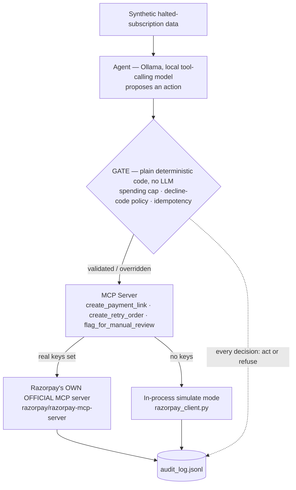

# Razorpay AI Buildathon — Subscription Recovery Agent

[](https://github.com/Ganesh-0509/razorpay-subscription-recovery-agent/actions/workflows/tests.yml)
[](LICENSE)

**Track 1 — AI Growth & Agentic Commerce**

A bounded, gated, audited agent that picks up exactly where Razorpay's own
subscription engine gives up — and a small, honest rebuild of the pattern
behind Razorpay's own Agent Studio, built to prove the architecture, not
to compete with the product.

---

## Table of Contents

1. [The Problem](#1-the-problem)
2. [What This Agent Does](#2-what-this-agent-does)
3. [How This Compares to Razorpay's Own Agent Studio](#3-how-this-compares-to-razorpays-own-agent-studio)
4. [Results, Verified Against Raw Logs](#4-results-verified-against-raw-logs)
5. [Visual Proof (No Frontend Needed)](#5-visual-proof-no-frontend-needed)
6. [Known Limitations](#6-known-limitations)
7. [Setup](#7-setup)
8. [Running It](#8-running-it)
9. [Testing](#9-testing)
10. [Stretch Goals](#10-stretch-goals)
11. [What Broke During Development](#11-what-broke-during-development)
12. [Further Reading](#12-further-reading)

---

## 1. The Problem

Razorpay auto-retries a failed recurring payment 3 times over 3 days
(T+3). If all 3 fail, the subscription moves to a `halted` state and
**nothing tries again automatically.** That gap — real, documented, and
specific to Razorpay's own product behavior — is what this agent fills:
it looks at subscriptions Razorpay's own system already gave up on, and
decides, case by case, whether anything can still be done.

## 2. What This Agent Does



The gate is the load-bearing safety design: the LLM only ever *proposes* a
structured decision through a single `record_decision` tool call — it
never directly calls a money-moving tool. A separate, deterministic layer
checks every proposal against a fixed decline-code policy table and hard
spending caps before anything reaches Razorpay, and overrides the LLM
whenever it's wrong (see [§4](#4-results-verified-against-raw-logs) for
exactly how often, and why that number is the point, not a flaw).

When real test-mode keys are set, the two money-moving tools
(`create_payment_link`, `create_retry_order`) route through **Razorpay's
own official MCP server** (github.com/razorpay/razorpay-mcp-server, Docker
image `mcp/razorpay`) instead of a hand-rolled SDK wrapper — verified live,
not just implemented (see [§5](#5-visual-proof--no-frontend-needed)).

**The policy is one editable config file, not a black box.** A merchant
doesn't need to retrain anything, touch Python, or redeploy to change how
a decline code is handled — the entire policy lives in
[`config/decline_policy.json`](config/decline_policy.json), loaded fresh
at startup and validated on load. For example, to stop nudging expired
cards with a payment link and switch to an immediate retry instead, the
entire change is:

```diff
   "card_expired": {
     "description": "Customer's card has passed its expiration date",
     "source": "customer",
-    "allowed_action": "payment_link_nudge",
+    "allowed_action": "immediate_retry",
     "simulated_success_rate": 0.35
   },
```

A typo here (e.g. `"allowed_aciton"` or an unrecognized action name) fails
loudly at startup naming the exact bad code and field —
`test_config_typo_in_allowed_action_fails_loudly` — rather than silently
enforcing a broken policy with total confidence.

## 3. How This Compares to Razorpay's Own Agent Studio

Razorpay's Agent Studio already ships a production Subscription Recovery
Agent — we picked this exact problem on purpose, not to compete with it,
but to prove the same proposal/execution-separation and audit-trail
pattern from first principles. Full reasoning in `BUILD_LOG.md` §1.1.

| | Their Subscription Recovery Agent | This project |
|---|---|---|
| Recovery mechanism | Voice call to the subscriber (ElevenLabs) | Payment link / automated retry |
| Guardrail logic | Internal certification process (closed) | One human-readable, validated JSON config |
| Audit trail | Hosted dashboard summary ("what/when") | Raw per-decision JSONL — LLM reasoning + gate override reasoning both logged |
| Access | Sales-assisted early access (Typeform) | Runs today, $0, personal test-mode account |
| **Test coverage** | Not public | **22 automated tests, CI-verified on every push** |
| **Domain scope** | Separate named agent per use case | **One gate/policy pattern reused unchanged across two domains** — subscriptions and one-time payments ([§10](#10-stretch-goals)) |
| **Model accuracy, published** | Not public | **Published in full** — exact match rate, confusion patterns, and two rounds of diagnosed prompt fixes ([`METRICS.md`](METRICS.md)) |
| **Real-integration proof** | N/A (their own product) | **Verifiable independently** — real Razorpay test-mode object IDs anyone can look up ([§5](#5-visual-proof--no-frontend-needed)) |

The point of this table isn't "we beat Razorpay's production team in a
week" — it's that everything on the right is a **real, checkable
artifact**, not a claim.

## 4. Results, Verified Against Raw Logs

Every number below was recomputed directly from `logs/audit_log.jsonl`,
not copied from prose — full derivation in [`METRICS.md`](METRICS.md).

| Metric | Value |
|---|---|
| Halted subscriptions processed | 150/150 |
| Simulated recovered amount | ₹54,362.43 of ₹1,50,729.35 total |
| **LLM proposal match rate** | **78.0%** (117/150) — up from 54.0% after fix 1, originally ~13% |
| LLM proposals the gate had to override | 22.0% (33/150) — down from 87% on the first run |
| Hard-blocked by gate (cap/duplicate) | 0 in the main pipeline; 1 real block in the Route demo |
| Real Razorpay objects created (real MCP server, real test keys) | 34 (`REAL_MCP_RESULTS.md` + `RESULTS_ONETIME.md`) |

The override rate isn't a bug to be embarrassed about — it's the
measured proof a supervisor layer is necessary. Two rounds of real
prompt-bug diagnosis (full detail in `METRICS.md` §2) took it from 87% to
22%, and the second fix's own side effects on 3 decline codes are
documented honestly rather than hidden, because that's the more useful
signal to a reviewer than a clean-looking number would be.

## 5. Visual Proof (No Frontend Needed)

This project is intentionally backend-only — the rubric asks for a
public repo, a 5-minute pitch video, and an architecture explanation, not
a hosted product. Here's what to actually show instead of a UI:

1. **`REPORT.html`** — a self-contained, offline static page built
   directly from the audit log (stat tiles, an override-rate figure,
   per-decline-code bars, a filterable table). Open it in a browser and
   screen-record it for the pitch video — regenerate any time with
   `python generate_report.py`.
2. **The architecture diagram in [§2](#2-what-this-agent-does)** — renders
   natively wherever this README is viewed (GitHub, GitLab). No image
   file, no design tool, just Mermaid syntax in the Markdown.
3. **The Razorpay dashboard itself, showing real objects** — the
   strongest, most independently-verifiable proof available. Log into
   `dashboard.razorpay.com` in **Test Mode**, go to **Orders** and
   **Payment Links**, and search for any ID from
   [`REAL_MCP_RESULTS.md`](REAL_MCP_RESULTS.md) (e.g. `order_TVya2xkz293ced`,
   `plink_TVyaB1NfbPJerN`). They exist in a real Razorpay account, created
   by this code, not just claimed in a log file. Screenshot that page —
   it's proof nobody can dispute since it comes from Razorpay's own UI,
   not ours.
4. **The GitHub Actions tab** — a screenshot of green checkmarks across
   the commit history is a fast, credible "this isn't a one-shot script"
   signal.
5. **A terminal recording of `--inject-failure`** — run
   `python agent.py --inject-failure llm_parse_failure` on camera. It's a
   real code path triggering live, on demand, not a historical log line
   read aloud.
6. **The commit history itself** (`git log --oneline` or the GitHub
   commits page) — real incremental commits with real messages, showing
   the project was actually built step by step, not generated in one shot.

## 6. Known Limitations

- **Single point of enforcement, not defense-in-depth.** The gate is only
  ever consulted because `agent.py` chooses to call it — the MCP tools
  themselves have no policy checks of their own. Fine for this project's
  scope; a real multi-caller production system would need the check moved
  inside the tool itself.
- **Idempotency is unit-tested but never exercised at batch scale.** No
  `subscription_id` repeats in the synthetic 150-record set by
  construction, so `RESULTS.md`'s "hard-blocked: 0" proves the check
  passes in isolation (`tests/test_gate.py`), not that it's been
  triggered under real batch conditions.
- **Simulate mode is still the default for the main 150-record batch.**
  The official-MCP-server integration has been verified end-to-end with
  real test-mode keys on smaller samples (`real_mcp_demo.py`,
  `agent_onetime.py` — 34 real objects total), but the full batch still
  runs simulated by default so the repo works for anyone without a
  Razorpay account.
- **A known, disclosed accuracy regression on 3 decline codes**
  (`authentication_failed`, `card_declined`, `payment_failed`) — a third
  schema fix resolved it on a targeted 33-record validation (100% match),
  but hasn't yet been confirmed with a full 150-record re-run. Full detail
  in `METRICS.md` §2.3.

Full project docs: [`BUILD_LOG.md`](BUILD_LOG.md) (problem statement, every
technical decision with reasoning, architecture, protocol, gate design,
real results — the single source of truth) ·
[`EASY_EXPLAINER.md`](EASY_EXPLAINER.md) (plain-language walkthrough, one
running example throughout) ·
[`GLOSSARY.md`](GLOSSARY.md) (every term used, defined) ·
[`METRICS.md`](METRICS.md) (every number verified directly against the raw
audit log, including the LLM's exact error patterns)

## 7. Setup

```bash
python -m venv .venv
.venv\Scripts\pip install -r requirements.txt

# Optional: real Razorpay test-mode keys (free, no KYC, from dashboard.razorpay.com)
# If skipped, everything runs in simulate mode automatically.
copy .env.example .env
# edit .env with your rzp_test_ keys

# Requires Ollama running locally with a tool-calling model pulled, e.g.:
ollama pull llama3.1:8b
```

## 8. Running It

```bash
cd src
python generate_data.py   # writes data/halted_subscriptions.json (synthetic)
python agent.py            # runs the full pipeline, writes RESULTS.md and logs/audit_log.jsonl

# Demo mode: force the "one failure handled gracefully" moment on the
# first record live, instead of pointing at a historical log line -
# python agent.py --inject-failure llm_parse_failure
# python agent.py --inject-failure llm_invalid_action

python generate_report.py  # writes REPORT.html - one static, offline page
                            # built from audit_log.jsonl (no server, no
                            # framework, no CDN), watchable in 10 seconds
                            # instead of scrolled through as raw JSONL
```

## 9. Testing

```bash
python -m pytest tests/ -v   # 22 tests, no Ollama server or real keys needed
```

The gate has unit tests independent of the LLM — it must be correct even
when the model isn't, since that's the entire point of having it. The
decline-code policy config is tested separately: if it's wrong (or a
merchant typos an edit), the gate must refuse to load it rather than
enforce the wrong thing with total confidence. `tests/test_ollama_client.py`
mocks the Ollama HTTP calls directly to exercise the failure paths that
actually happened during development — no tool call, malformed arguments,
a transient failure that retries and recovers, and retries fully
exhausted without crashing the caller.

## 10. Stretch Goals

**Generalizing beyond subscriptions:**

```bash
cd src
python generate_data_onetime.py   # writes data/failed_onetime_payments.json
python agent_onetime.py            # writes RESULTS_ONETIME.md and logs/audit_log_onetime.jsonl
```

Proves the gate/policy/audit-log pattern isn't subscription-specific: the
exact same `Gate`, `config/decline_policy.json`, and MCP tools handle
failed one-time payments too, with only the LLM's situation description
changed. `gate.py` needed zero changes. Full reasoning in `BUILD_LOG.md` §13.

**Route (split settlement):**

```bash
cd src
python route_demo.py   # writes ROUTE_RESULTS.md
```

Standalone scenario: a referral partner earns a percentage of a recovered
subscription via a Razorpay Route transfer, split at order-creation time.
Also demonstrates the same spending-cap gate blocking an oversized transfer.

**Cost: $0.** Everything here runs free — see `BUILD_LOG.md` §2.1 for the
full breakdown. Razorpay test mode needs no KYC, no payment method, no
live keys. The agent model runs locally via Ollama, not a paid API.

## 11. What Broke During Development

Documented in full in `BUILD_LOG.md` §3.6/§12, kept in because it's real:

1. First version of the gate conflated "the LLM's proposal was denied" with
   "no action should be taken" — meaning every LLM policy mismatch silently
   skipped execution instead of running the corrected action. Caught by a
   5-record smoke test before the full run, fixed by splitting the gate's
   decision into `llm_matched_policy` (a metric on the model) and `execute`
   (whether the corrected action actually runs).
2. The first full 150-record run crashed outright on a transient Ollama 500
   — traced to the model being reloaded from disk on every single call
   (~20s each) instead of staying resident, which also made the whole run
   impractically slow. Fixed with `keep_alive`, request retry/backoff, and
   a per-record try/except so one bad record can never take down the batch.
3. The batch run got killed by the execution environment mid-run — three
   separate times across development. Rather than just relaunch and hope,
   made the pipeline checkpointed and resumable
   (`logs/results_checkpoint.jsonl`) — confirmed working every time,
   including a real kill at 124/150 during the accuracy re-run that
   resumed cleanly with zero lost work.
4. An independent audit caught that the LLM's ~87% policy-override rate was
   partly self-inflicted: the tool schema gave the model an action enum
   with no per-value explanation, so it was reading `no_action_fraud` as a
   generic "no action needed" bucket rather than "this is specifically
   fraud." Fixed by spelling out exactly what each action means — brought
   the rate to 46%.
5. A second, deeper diagnosis (`METRICS.md` §2) found two more systematic
   biases behind that remaining 46% and fixed them with an ordered
   decision rule — bringing the rate to 22%, but introducing a new,
   smaller regression on 3 codes, documented rather than hidden
   (`METRICS.md` §2.2).

## 12. Further Reading

| Doc | What's in it |
|---|---|
| [`BUILD_LOG.md`](BUILD_LOG.md) | The single source of truth — problem statement, every technical decision with reasoning, architecture, protocol, gate design, full results |
| [`EASY_EXPLAINER.md`](EASY_EXPLAINER.md) | Plain-language walkthrough, one running example throughout, no jargon |
| [`GLOSSARY.md`](GLOSSARY.md) | Every acronym/term used anywhere, expanded |
| [`METRICS.md`](METRICS.md) | Every headline number, re-derived from raw logs, including the model's exact error patterns |
| [`RESULTS.md`](RESULTS.md) / [`RESULTS_ONETIME.md`](RESULTS_ONETIME.md) / [`ROUTE_RESULTS.md`](ROUTE_RESULTS.md) | Auto-generated per-run output |
| [`REAL_MCP_RESULTS.md`](REAL_MCP_RESULTS.md) | Real Razorpay test-mode objects created via the official MCP server |
