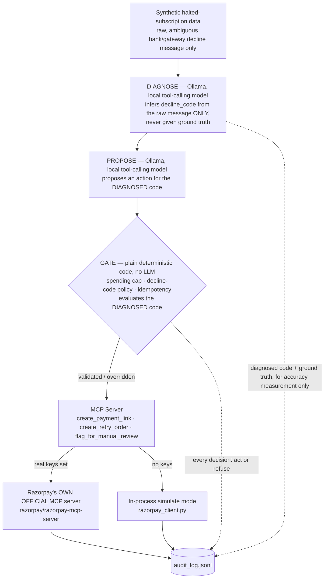

# Razorpay AI Buildathon — Subscription Recovery Agent

[](https://github.com/Ganesh-0509/razorpay-subscription-recovery-agent/actions/workflows/tests.yml)
[](LICENSE)

**Track 3 — AI Revenue Recovery**

A bounded, gated, audited agent that picks up exactly where Razorpay's own
subscription engine gives up — detects a halted subscription, decides the
right recovery intervention, and executes it with a measured ₹ recovered,
stopping rules, and a full audit trail. Also a small, honest rebuild of the
pattern behind Razorpay's own Agent Studio, built to prove the
architecture, not to compete with the product.

---

## Table of Contents

1. [The Problem](#1-the-problem)
2. [What This Agent Does](#2-what-this-agent-does)
3. [How This Compares to Razorpay's Own Agent Studio](#3-how-this-compares-to-razorpays-own-agent-studio)
4. [Results, Verified Against Raw Logs](#4-results-verified-against-raw-logs)
5. [Visual Proof (No Frontend Needed)](#5-visual-proof-no-frontend-needed)
6. [Known Limitations](#6-known-limitations)
7. [Setup](#7-setup)
8. [Running It](#8-running-it)
9. [Testing](#9-testing)
10. [Stretch Goals](#10-stretch-goals)
11. [What Broke During Development](#11-what-broke-during-development)
12. [Further Reading](#12-further-reading)

---

## 1. The Problem

Razorpay auto-retries a failed recurring payment 3 times over 3 days
(T+3). If all 3 fail, the subscription moves to a `halted` state and
**nothing tries again automatically.** That gap — real, documented, and
specific to Razorpay's own product behavior — is what this agent fills:
it looks at subscriptions Razorpay's own system already gave up on, and
decides, case by case, whether anything can still be done.

## 2. What This Agent Does



**Diagnosis is a real, separate stage now, not a given input.** Before
this addition, `decline_code` was assigned as ground truth by the
synthetic-data generator and handed to the rest of the pipeline as a fact
— there was no step anywhere that actually *inferred* it, even though the
track's own problem statement names diagnosis as its own stage, distinct
from choosing an intervention ("diagnosing it" / "Payment degradation →
root cause → recovery action"). `diagnose.py` now infers `decline_code`
from ONLY a raw, human/bank-style decline message
(`raw_decline_message`, `generate_data.py`) via a real Ollama tool call —
never given the ground-truth code — and the DIAGNOSED code, not ground
truth, is what the action-proposal prompt, the gate, and execution all
act on downstream. A wrong diagnosis therefore has real consequences: the
gate looks up the wrong policy row. Ground truth is still recorded, but
only to measure `diagnosis_matched_ground_truth` honestly in the audit
log — see [§6](#6-known-limitations) for the real, measured accuracy from
a live run, and exactly what it does and doesn't cover.

The gate is the load-bearing safety design: the LLM only ever *proposes* a
structured decision through a single `record_decision` tool call — it
never directly calls a money-moving tool. A separate, deterministic layer
checks every proposal against a fixed decline-code policy table and hard
spending caps before anything reaches Razorpay, and overrides the LLM
whenever it's wrong (see [§4](#4-results-verified-against-raw-logs) for
exactly how often, and why that number is the point, not a flaw).

The gate also enforces two **compliant-escalation stopping rules**
("compliant" here means *bounded and attempt-capped*, not integrated with
real regulatory regimes like TRAI/DND or RBI's e-mandate window — see
[§6](#6-known-limitations) for the explicit scope line) at the
cross-run level, on top of same-run idempotency and the spending cap: a
subscription gets handed to a human (`flag_for_manual_review`) instead of
nudged again once it has **3 prior real recovery attempts across any
previous run** (derived from the audit log's own history, not a per-process
counter — `gate.py`'s `MAX_ATTEMPTS_PER_SUBSCRIPTION`), or once it's been
**halted 12+ days** (`STALE_HALT_ESCALATION_DAYS`) and judged too cold for
an automated nudge to still be the right call. Both are proven by dedicated
deterministic unit tests, not asserted — see `BUILD_LOG.md` §12.

When real test-mode keys are set, the two money-moving tools
(`create_payment_link`, `create_retry_order`) route through **Razorpay's
own official MCP server** (github.com/razorpay/razorpay-mcp-server, Docker
image `mcp/razorpay`) instead of a hand-rolled SDK wrapper — verified live,
not just implemented (see [§5](#5-visual-proof--no-frontend-needed)).

**The policy is one editable config file, not a black box.** A merchant
doesn't need to retrain anything, touch Python, or redeploy to change how
a decline code is handled — the entire policy lives in
[`config/decline_policy.json`](config/decline_policy.json), loaded fresh
at startup and validated on load. For example, to stop nudging expired
cards with a payment link and switch to an immediate retry instead, the
entire change is:

```diff
   "card_expired": {
     "description": "Customer's card has passed its expiration date",
     "source": "customer",
-    "allowed_action": "payment_link_nudge",
+    "allowed_action": "immediate_retry",
     "simulated_success_rate": 0.35
   },
```

A typo here (e.g. `"allowed_aciton"` or an unrecognized action name) fails
loudly at startup naming the exact bad code and field —
`test_config_typo_in_allowed_action_fails_loudly` — rather than silently
enforcing a broken policy with total confidence.

## 3. How This Compares to Razorpay's Own Agent Studio

Razorpay's Agent Studio already ships a production Subscription Recovery
Agent — we picked this exact problem on purpose, not to compete with it,
but to prove the same proposal/execution-separation and audit-trail
pattern from first principles. Full reasoning in `BUILD_LOG.md` §1.1.

| | Their Subscription Recovery Agent | This project |
|---|---|---|
| Recovery mechanism | Voice call to the subscriber (ElevenLabs) | Payment link / automated retry |
| Guardrail logic | Internal certification process (closed) | One human-readable, validated JSON config |
| Audit trail | Hosted dashboard summary ("what/when") | Raw per-decision JSONL — LLM reasoning + gate override reasoning both logged |
| Access | Sales-assisted early access (Typeform) | Runs today, $0, personal test-mode account |
| **Test coverage** | Not public | **90 automated tests, CI-verified on every push** |
| **Domain scope** | Separate named agent per use case | **One gate/policy pattern reused unchanged across two domains** — subscriptions and one-time payments ([§10](#10-stretch-goals)) |
| **Model accuracy, published** | Not public | **Published in full** — exact match rate, confusion patterns, and two rounds of diagnosed prompt fixes ([`METRICS.md`](METRICS.md)) |
| **Real-integration proof** | N/A (their own product) | **Verifiable independently** — real Razorpay test-mode object IDs anyone can look up ([§5](#5-visual-proof--no-frontend-needed)) |

The point of this table isn't "we beat Razorpay's production team in a
week" — it's that everything on the right is a **real, checkable
artifact**, not a claim.

## 4. Results, Verified Against Raw Logs

Every number below was recomputed directly from `logs/audit_log.jsonl`,
not copied from prose — full derivation in [`METRICS.md`](METRICS.md).

| Metric | Value |
|---|---|
| Halted subscriptions processed | 150/150 |
| Actions executed (retries/nudges the gate let through) | 109/150 |
| Simulated recovered amount | ₹44,856.72 of ₹1,50,729.35 total |
| **LLM proposal match rate** | **99.3%** (149/150) — up from 78.0%, 54.0%, originally ~13% across 3 real prompt fixes — **unchanged by the escalation-rules update below**, since `llm_matched_policy` is computed before either new rule runs |
| LLM proposals the gate had to override | 0.7% (1/150) — down from 87% on the first run |
| **Escalated to manual review by the new compliant-escalation rules** | **34/150** — all via the stale-halt threshold (§12: `halted_days_ago` ≥ 12); the cross-run attempt cap fired 0 times in this single-pass run by construction (same honest-disclosure pattern as idempotency below), demoed instead via `--inject-failure repeat_attempts` and dedicated unit tests |
| Hard-blocked by gate (cap/duplicate) | 0 in the main pipeline; 1 real block in the Route demo |
| Real Razorpay objects created (real MCP server, real test keys) | 34 (`REAL_MCP_RESULTS.md` + `RESULTS_ONETIME.md`) — coincidentally the same number as the escalation count above; unrelated figures |

**The recovered amount is lower than an earlier version of this run
(₹44,856.72 vs. a since-superseded ₹54,362.43) on purpose, not as a
regression.** Adding the stale-halt stopping rule means 34 subscriptions
that would previously have been auto-nudged are now correctly escalated to
a human instead, since they've been halted 12+ days and are judged too
cold for an automated attempt to still be the right call. That's fewer
executed actions and less simulated recovery, in exchange for actually
having the "stopping rules" + "compliant escalation" behavior the rubric
asks for, backed by a real 150-record run instead of only unit tests. The
pre-escalation-rules run is preserved at `logs/pre_escalation_rules/` for
direct comparison, following this project's existing convention of never
deleting a superseded run's raw log (`logs/pre_accuracy_fix/`,
`logs/run3_before_third_fix/`).

The override rate isn't a bug to be embarrassed about — it's the
measured proof a supervisor layer is necessary, and that stays true even
as it shrinks. Three rounds of real prompt-bug diagnosis (full detail in
`METRICS.md` §2) took it from 87% to 46% to 22% to 0.7% — including one
fix's own side effects on 3 decline codes, found and then fixed in the
next round, all documented honestly rather than smoothed over. The single
remaining mismatch (`debit_instrument_blocked`, n=1) is a genuinely
ambiguous single case, not a pattern. And the gate doesn't retire even at
0.7%: the spending cap and idempotency checks are properties of the
money-moving action itself, not of the model's judgment.

**One honest caveat, found and then tested twice, not just disclosed:**
the 150-record match rate is really **15 unique scenarios**, not 150 —
`decline_description` is a fixed string per code and the model runs at
`temperature: 0`, so every record sharing a code gets the identical
proposed action every time (verified directly, zero variance). Tested
this two ways instead of leaving it as an unresolved gap:

- **16 clean paraphrases**, sharing no wording with the fixed catalog:
  **16/16 (100%)** matched policy (`METRICS.md` §2.4).
- **16 deliberately adversarial descriptions** — real payments jargon
  (`3DS`, `CNP`, `acquirer`), terse log-style text: **15/16 (93.8%)**,
  with one real miss — a fraud case read as customer-actionable despite
  the description containing the word "risk" twice. **This miss doesn't
  reach Razorpay either way:** the gate looks up the correct action from
  the actual `decline_code`, never from the LLM's reading of any
  description, so this is concrete, adversarially-discovered proof of
  exactly why the LLM's proposal never executes directly (`METRICS.md` §2.5).

## 5. Visual Proof (No Frontend Needed)

This project is intentionally backend-only — the rubric asks for a
public repo, a 5-minute pitch video, and an architecture explanation, not
a hosted product. Here's what to actually show instead of a UI:

1. **`REPORT.html`** — a self-contained, offline static page built
   directly from the audit log (stat tiles, an override-rate figure,
   per-decline-code bars, a filterable table). Open it in a browser and
   screen-record it for the pitch video — regenerate any time with
   `python generate_report.py`.
2. **`POLICY_DASHBOARD.html`** — a second self-contained, offline static
   page, this one for the merchant side of the pitch: every decline code
   in `config/decline_policy.json`, in plain English, with a source/action
   breakdown and real filters (search, source, action) — no more digging
   through a `.py` file to know what `payment_link_nudge` actually does.
   Regenerate any time with `python generate_policy_dashboard.py`. It is
   deliberately **read-only** — see [§6](#6-known-limitations) for exactly
   why a live editable version isn't offered.
3. **The architecture diagram in [§2](#2-what-this-agent-does)** — renders
   natively wherever this README is viewed (GitHub, GitLab). No image
   file, no design tool, just Mermaid syntax in the Markdown.
4. **The Razorpay dashboard itself, showing real objects** — the
   strongest, most independently-verifiable proof available. Log into
   `dashboard.razorpay.com` in **Test Mode**, go to **Orders** and
   **Payment Links**, and search for any ID from
   [`REAL_MCP_RESULTS.md`](REAL_MCP_RESULTS.md) (e.g. `order_TVya2xkz293ced`,
   `plink_TVyaB1NfbPJerN`). They exist in a real Razorpay account, created
   by this code, not just claimed in a log file. Screenshot that page —
   it's proof nobody can dispute since it comes from Razorpay's own UI,
   not ours.
5. **The GitHub Actions tab** — a screenshot of green checkmarks across
   the commit history is a fast, credible "this isn't a one-shot script"
   signal.
6. **A terminal recording of `--inject-failure`** — run
   `python agent.py --inject-failure llm_parse_failure` on camera. It's a
   real code path triggering live, on demand, not a historical log line
   read aloud.
6. **The commit history itself** (`git log --oneline` or the GitHub
   commits page) — real incremental commits with real messages, showing
   the project was actually built step by step, not generated in one shot.

## 6. Known Limitations

- **New: revenue-at-risk detection is now a real, separate, fallible stage — closing another previously-undisclosed gap — but only proven live on a 30-record mixed pool, not wired into the 150-record flagship batch.**
  `PS_REQUIREMENTS_DEBATE.md` (Round 2, finding 4) found that `agent.py` never actually
  detects anything — it unconditionally processes every record in `data/halted_subscriptions.json`,
  a file whose name and contents guarantee every record is already at-risk. Both agents in that
  debate judged this more defensible than the diagnosis gap (Razorpay's real T+3 auto-halt cycle
  takes several real days to reproduce live, a genuine one-week-build constraint), but it was still
  a real, unaddressed gap: there was no step anywhere that looked at a *mix* of subscriptions —
  healthy and at-risk together — and decided which ones need attention at all. Fixed with a
  genuinely new capability, not a relabeled lookup, and without reintroducing the multi-day-wait
  infeasibility:
  - `generate_detection_pool.py` (a new sibling to `generate_data.py`, not an edit to it) produces
    a MIXED pool (`data/detection_pool.json`) — some records genuinely healthy (no retries, no
    decline code, a recent successful charge), some genuinely at-risk (real retries, a stale gap
    since the last successful charge, a real decline code kept only as ground truth for scoring).
    A deliberate ambiguity cluster (`subscription_status="pending"`, `previous_retry_count=1`) spans
    BOTH ground truths — a resolved one-off blip and the earliest sign of real trouble look
    identical on those two fields alone, same design principle as the diagnosis stage's shared
    raw-text clusters below.
  - `detect.py` is a new stage that classifies each record via a real Ollama tool call
    (`record_detection`, temperature 0, llama3.1:8b) — a THIRD, separate tool schema from both the
    diagnosis and action-decision ones, since detection, diagnosis, and intervention-selection are
    three distinct stages per the problem statement's own wording. Given ONLY four synthetic-but-
    realistic signals a real merchant/Razorpay account already has without waiting on a multi-day
    retry cycle (`previous_retry_count`, `days_since_last_successful_charge`,
    `most_recent_gateway_response`, `subscription_status`) — never a precomputed `is_at_risk` boolean.
  - Critically, a `"leave_alone"` classification is a **real short-circuit**, not a logged-and-
    ignored label: `recovery_pipeline.py` runs detection before everything else, and a record
    cleared as healthy never reaches diagnosis, the action proposal, or the gate at all. A wrong
    call has a proven real consequence either direction — `tests/test_detection_pipeline.py` mocks
    both a false negative (an at-risk record wrongly cleared: proven never diagnosed, gated, or
    recovered) and a false positive (a healthy record wrongly flagged: proven to trigger a real,
    wasted `flag_for_manual_review` tool call) — not merely asserted.
  - **Real, measured accuracy from a live run through the actual local Ollama server (not mocked,
    not assumed): 30/30 (100.0%)** on a 30-record mixed pool (16 at-risk, 14 healthy —
    `DETECTION_DEMO_RESULTS.md`), including all 8 deliberately-ambiguous records in that slice
    (re-checked directly, not assumed absent). Zero false positives, zero false negatives. Stated
    honestly: this is one run against one seeded pool, not an adversarial/paraphrased stress test
    the way action-proposal accuracy was (§4's 16+16 adversarial rounds) — a clean number here is
    not a claim that this stage is infallible, just what was actually measured.
  - **What this does NOT fix, stated plainly:** detection is **not** wired into `agent.py` or the
    150-record flagship batch — `data/halted_subscriptions.json` still has no detection signal
    fields, and every one of its records is still processed unconditionally, exactly as the debate
    originally found. The fix is demonstrated as solved in isolation, against a separate mixed pool,
    not integrated into the main pipeline's every-record-is-already-at-risk premise. Detection also
    still runs against a pre-generated file, not a live Razorpay account or webhook — the underlying
    "reproducing a multi-day halt cycle live" constraint is unchanged; what's new is that a genuine
    classification decision with real downstream teeth now exists where none did before.
- **New: root-cause diagnosis is now a real, separate, fallible stage — closing a previously-undisclosed gap — but only proven live on a 30-record subset, not the full 150-record flagship batch.**
  An independent, PS-only requirements review (`PS_REQUIREMENTS_DEBATE.md`, Round 2) found that
  `decline_code` was assigned as ground truth by `generate_data.py`'s weighted RNG and consumed
  everywhere downstream (`gate.py`, `ollama_client.py`) as a given fact — despite the track's own
  "why now" paragraph naming diagnosis as its own stage, distinct from choosing an intervention
  ("diagnosing it" / "Payment degradation → root cause → recovery action"). Fixed with a genuinely
  new capability, not a relabeled lookup:
  - `generate_data.py` now attaches a `raw_decline_message` field to every record — a raw,
    human/bank-style decline string (grounded in the same real Razorpay decline-code taxonomy
    `decline_codes.py` already cites) that is never a restatement of `decline_code`. Three clusters
    of codes deliberately share an *identical* raw-text pool despite mapping to different recovery
    actions (`card_declined`/`payment_failed`/`payment_risk_check_failed`;
    `debit_instrument_blocked`/`debit_instrument_inactive`; `payment_cancelled`/`authentication_failed`)
    — real, structural ambiguity (e.g. banks routinely surface an undisclosed risk/fraud hold as a
    generic "do not honor," identical to an ordinary decline), not an artificial difficulty knob.
  - `diagnose.py` is a new stage that infers `decline_code` from ONLY that raw message via a real
    Ollama tool call (`record_diagnosis`, temperature 0, llama3.1:8b) — a different tool schema
    from the existing action-decision one, since diagnosis and intervention-selection are two
    distinct stages per the problem statement. It is never given the ground-truth code.
  - Critically, the **rest of the pipeline acts on the DIAGNOSED code, not ground truth** —
    `recovery_pipeline.py`'s action-proposal prompt, `gate.evaluate()`, and execution all use the
    diagnosed code, so a wrong diagnosis has real downstream consequences (the gate looks up the
    wrong policy row), not just a logged-and-ignored accuracy statistic. Ground truth is still
    recorded, but only to compute `diagnosis_matched_ground_truth` in the audit log, exactly like
    `llm_matched_policy` already measures action-proposal accuracy without feeding back into it.
  - **Real, measured accuracy from a live run through the actual local Ollama server (not mocked,
    not assumed): 27/30 (90.0%)** on the first 30 records of the seeded, already-committed
    150-record dataset (`DIAGNOSIS_DEMO_RESULTS.md`) — a deterministic slice, not cherry-picked.
    All 3 misdiagnoses landed inside the deliberately-ambiguous clusters above (two
    `card_disabled_for_online_payments`→`card_not_enrolled` confusions, one
    `card_declined`→`payment_failed` confusion), confirming the ambiguity design is doing its job —
    this is the honest, correct outcome to report, not a bug to hide. **Final recovery action
    changed by a misdiagnosis in this run: 0/30** — every miss happened to land on a code sharing
    the same `allowed_action` (`payment_link_nudge`) as the true code, so this particular 30-record
    slice didn't happen to exercise a cross-action miss. **Said plainly: this does NOT mean a wrong
    diagnosis can't change the final action** — `tests/test_diagnosis_pipeline.py` proves directly,
    with a mocked diagnosis, that it does (a misdiagnosis from `insufficient_funds`→
    `debit_instrument_blocked` flips `delayed_retry`→`no_action_unrecoverable`) — it means the
    highest-stakes ambiguity codes (`payment_risk_check_failed`, `debit_instrument_blocked`,
    `debit_instrument_inactive`, `payment_cancelled`) are low-weight in `CODE_WEIGHTS` and simply
    didn't appear at all in this particular first-30-records slice, by construction, not by design
    intent to hide anything.
  - **What this does NOT fix, stated plainly:** the full 150-record flagship batch
    (`RESULTS.md`/`logs/audit_log.jsonl`, referenced throughout §4) was **not** re-run with
    diagnosis — doing so needs two live Ollama calls per record instead of one, and re-running all
    150 was not completed in this session (see `BUILD_LOG.md` §14 for the honest timing accounting).
    `RESULTS.md` and `logs/audit_log.jsonl` are therefore **untouched** by this change and still
    describe the pre-diagnosis pipeline exactly as before — nothing was silently overwritten.
    `agent_onetime.py` (the one-time-payment stretch pipeline, §10) also does **not** diagnose —
    `recovery_pipeline.py`'s diagnosis stage is opt-in per caller, and only `agent.py` opts in.
    Diagnosis accuracy was measured on 30/150 records (20%), not the full dataset, and not on any
    adversarial/paraphrased set the way action-proposal accuracy was (§4's 16+16 adversarial round) —
    a real, disclosed limit on how far the 90.0% figure generalizes.

- **New: checkout abandonment — one of the two previously-unimplemented revenue-loss categories — is now a real, separate, standalone domain, closing part of the category-scope gap below. (Overdue receivables, the other half, is closed by a separate entry further down — see "overdue receivables" below.)**
  The category-scope gap immediately below was found by a direct, deliberate re-check of the
  codebase against the problem statement's exact wording. This entry closes ONE of its two
  missing categories: checkout abandonment (a customer who started checkout but never completed
  a payment attempt at all — structurally different from every other domain in this repo, since
  there is no `decline_code`, because no payment was ever attempted or declined).
  - `checkout_abandonment_policy.py`/`config/abandonment_policy.json` — a parallel, not a reuse,
    of `decline_codes.py`/`config/decline_policy.json`: its own `AbandonmentReason` taxonomy
    (`otp_delay_or_failure`, `payment_method_unsupported`, `price_shock`,
    `distraction_or_multitasking`, `trust_or_security_concern`), same "fail loudly on a config
    typo" discipline, same `_action_glossary` merchant-readability pattern.
  - `diagnose_checkout_abandonment.py` — a genuine diagnosis stage (a fourth distinct Ollama tool
    schema in this project) that infers WHY a customer abandoned from ONLY structured funnel
    signals (`checkout_stage`, `minutes_since_abandonment`, `device_type`,
    `is_returning_customer`) — never given the ground-truth reason. Deliberately shaped like
    `detect.py` (structured signals in) rather than `diagnose.py` (free-text in), since a checkout
    funnel realistically emits telemetry, not a human-written decline sentence — a disclosed
    modeling choice, not a missed chance to reuse code.
    `generate_checkout_abandonment_data.py` builds two deliberate ambiguity clusters (shared
    signal combinations spanning two different ground-truth reasons), mirroring §14's own
    diagnosis-ambiguity design, verified by dedicated tests, not merely claimed.
  - `abandonment_gate.py` is its OWN small enforcement layer, NOT a call into `gate.py`'s
    `Gate.evaluate()` — a deliberate choice, explained in the module's own docstring, made for the
    same reason `route_demo.py` already has its own check: `Gate.evaluate()`'s signature is built
    entirely around a `decline_code` lookup and an LLM-proposal-to-override, neither of which
    exists in this domain (there is no decline code, and — also a disclosed choice, see
    `checkout_abandonment_agent.py`'s docstring — no second LLM call proposing an action either,
    since the action is a deterministic function of the diagnosed reason). It DOES reuse
    `gate.py`'s real `MAX_ACTION_AMOUNT_PAISE` constant for its own spending cap, plus two new
    domain-specific stopping rules with no main-pipeline equivalent: a minimum-cart-value floor
    (`MIN_CART_VALUE_FOR_ACTION_PAISE`, since nothing in `gate.py` ever caps a *minimum*) and a
    stale-abandonment threshold measured in hours, not the 12 *days* `gate.py` uses for halted
    subscriptions — checkout intent cools far faster than a subscription retry cadence.
  - `checkout_abandonment_agent.py` routes every actionable outcome through the REAL, unmodified
    `mcp_server.py`'s `create_payment_link` tool (no new MCP tool was needed) and every no-action
    outcome through `flag_for_manual_review`, in SIMULATE mode by default — kept entirely separate
    from the flagship pipeline, exactly like `agent_onetime.py`/`route_demo.py` already are:
    `data/halted_subscriptions.json`, `logs/audit_log.jsonl`, and `RESULTS.md` are untouched. Own
    data (`data/abandoned_checkouts.json`), own audit log
    (`logs/audit_log_checkout_abandonment.jsonl`), own results file
    (`CHECKOUT_ABANDONMENT_RESULTS.md`).
  - A wrong diagnosis has a proven real consequence, not a cosmetic mislabel — mirroring §14's own
    load-bearing test exactly:
    `tests/test_checkout_abandonment_pipeline.py::test_wrong_diagnosis_changes_the_final_action_real_downstream_consequences`
    mocks a misdiagnosis and asserts the gate executes the wrong policy's action
    (`flag_for_manual_review` instead of `create_payment_link`).
  - **Real, measured numbers from a live run against the real local Ollama server (llama3.1:8b,
    not mocked)** are in `CHECKOUT_ABANDONMENT_RESULTS.md` and BUILD_LOG.md's dated
    checkout-abandonment section — stated there rather than duplicated here, so this bullet
    doesn't drift out of sync with the one place that number is computed.
  - **What this does NOT prove:** this is a standalone demonstration, not integrated into the
    150-record flagship batch or `agent.py` in any way — mirrors §10's existing "generalizing
    beyond subscriptions" stretch goal in spirit and in isolation, not in wiring. The dataset is
    synthetic and schema-accurate, not sourced from a real checkout funnel.
- **New: overdue receivables — the LAST of the three previously-unimplemented revenue-loss
  categories — is now also a real, separate, standalone domain, closing the rest of the
  category-scope gap below.** A B2B invoice that has gone unpaid past its due date — structurally
  different from every other domain in this repo (no `decline_code`, no checkout funnel; this
  category revolves entirely around an aging clock, `days_overdue`, plus a business's own
  payment-history and reminder-communication signals).
  - `receivables_policy.py`/`config/receivables_policy.json` — a third parallel, not a reuse, of
    `decline_codes.py`/`config/decline_policy.json` and
    `checkout_abandonment_policy.py`/`config/abandonment_policy.json`: its own `ReceivableReason`
    taxonomy (`cash_flow_delay`, `payment_process_friction`,
    `chronic_late_payer_will_eventually_pay`, `invoice_dispute_likely`, `high_risk_non_payment`),
    same "fail loudly on a config typo" discipline, same `_action_glossary` merchant/collections-team
    readability pattern.
  - `diagnose_receivable.py` — a genuine diagnosis stage (a FIFTH distinct Ollama tool schema in
    this project) that infers WHY an invoice is overdue from ONLY `days_overdue`, `payment_terms`,
    `customer_payment_history_signal`, `reminders_sent_count`, `last_reminder_response`, and (as
    context) `amount_vs_typical_ratio` — never given the ground-truth `case_reason`.
    `generate_receivables_data.py` builds two deliberate ambiguity clusters (shared signal
    combinations spanning two different ground-truth reasons: a first-time-overdue/no-reminders/
    early-days cluster shared by `cash_flow_delay`/`payment_process_friction`, and a
    disputes-history/silent-reminder-response cluster shared by
    `invoice_dispute_likely`/`high_risk_non_payment`), mirroring §14's/checkout abandonment's own
    diagnosis-ambiguity design, verified by dedicated tests, not merely claimed.
  - `receivables_gate.py` is its OWN small enforcement layer, NOT a call into `gate.py`'s
    `Gate.evaluate()` — the same considered choice `abandonment_gate.py` already made, for the same
    reason. It reuses `gate.py`'s real `MAX_ACTION_AMOUNT_PAISE` constant (disclosed honestly: B2B
    invoices are frequently larger than a checkout cart or subscription charge, so this cap fires
    more often here — an intended consequence, not an oversight), plus this domain's own
    **compliant-escalation stopping rules**: a reminder-count cap
    (`MAX_REMINDERS_BEFORE_ESCALATION = 4` — after 4 automated reminders with no payment, hand off
    to a human instead of continuing to auto-chase indefinitely) and a staleness threshold
    (`DAYS_OVERDUE_LEGAL_REVIEW_THRESHOLD = 90` days — a common real-world B2B AR aging boundary
    past which an account needs human/legal collections review, not another automated nudge).
  - `receivables_agent.py` routes every actionable outcome through the REAL, unmodified
    `mcp_server.py`'s `create_payment_link` tool (no new MCP tool was needed) and every no-action/
    escalation outcome through `flag_for_manual_review`, in SIMULATE mode by default — kept
    entirely separate from the flagship pipeline and from `checkout_abandonment_agent.py`, exactly
    like `agent_onetime.py`/`route_demo.py` already are: `data/halted_subscriptions.json`,
    `data/abandoned_checkouts.json`, and both existing results/audit-log files are untouched. Own
    data (`data/overdue_invoices.json`), own audit log (`logs/audit_log_receivables.jsonl`), own
    results file (`RECEIVABLES_RESULTS.md`).
  - A wrong diagnosis has a proven real consequence, not a cosmetic mislabel — mirroring §14's and
    checkout abandonment's own load-bearing test exactly:
    `tests/test_receivables_pipeline.py::test_wrong_diagnosis_changes_the_final_action_real_downstream_consequences`
    mocks a misdiagnosis and asserts the gate executes the wrong policy's action
    (`flag_for_manual_review` instead of `create_payment_link`).
  - **Real, measured numbers from a live run against the real local Ollama server (llama3.1:8b,
    not mocked)** are in `RECEIVABLES_RESULTS.md` and BUILD_LOG.md's dated overdue-receivables
    section — stated there rather than duplicated here, so this bullet doesn't drift out of sync
    with the one place that number is computed.
  - **What this does NOT prove:** this is a standalone demonstration, not integrated into the
    150-record flagship batch, `agent.py`, or `checkout_abandonment_agent.py` in any way. The
    dataset is synthetic and schema-accurate, not sourced from a real accounts-receivable system.
- **New: this project now covers all three revenue-loss categories Track 3's own problem
  statement names — the category-scope gap first disclosed here is now closed, and (BUILD_LOG.md
  §18) all four domains now share one real dispatch entry point, though that is not the same
  claim as one merged decision engine — see the bullet below for exactly what is and isn't
  shared.** The official track text asks for an agent spanning
  "payment failures and checkout abandonment... to overdue receivables." What's built:
  `agent.py`/`agent_onetime.py` cover "payment failures" (two entry points),
  `checkout_abandonment_agent.py` covers "checkout abandonment", and `receivables_agent.py`
  (above) covers "overdue receivables" — each a genuinely different data model and reasoning
  shape (a decline-code lookup; structured checkout-funnel telemetry; an aging clock plus payment
  history), not three thin variants of the same thing. `config/decline_policy.json`'s 16 entries
  remain all keyed by real Razorpay decline codes — structurally incompatible with the other two
  categories as-is, which is exactly why each got its own separate, structurally different policy
  table instead of a force-fit onto the existing one. This was found on a direct, deliberate
  re-check of the codebase against the problem statement's exact wording (the same kind of audit
  that caught the compliant-escalation gap below), not caught earlier because the project's own
  self-audit passes had re-read this exact rubric sentence for "compliant escalation" but never
  for its other two nouns. All three domains are built deep (payment failures: 44 tests, three
  rounds of diagnosed LLM accuracy fixes, batch-scale idempotency proof; checkout abandonment and
  overdue receivables: each its own diagnosis stage, policy table, and enforcement layer, tested
  and live-demonstrated) — and, as of `src/integrated_pipeline.py` (BUILD_LOG.md §18), one real
  entry point now takes a genuinely mixed, interleaved batch of records from all four domains
  (subscriptions/one-time payments/checkout abandonment/overdue receivables) and routes each one,
  purely by its own shape, to the domain-specific logic that already existed and was already
  proven — without merging any domain's gate, policy table, or audit-log schema, which stay
  deliberately separate for the same reasons stated in BUILD_LOG.md §16/§17. Real, measured
  numbers from a live mixed run are in `INTEGRATED_RESULTS.md` and BUILD_LOG.md §18. **What this
  does NOT do:** it is a dispatch layer over four still-separate decision engines, not one merged
  gate; the live-run batch was scaled down to 16 records (4/domain) rather than the originally
  planned 60, a disclosed consequence of this machine's local Ollama inference latency, not a
  mocked or projected number (BUILD_LOG.md §18 explains why).
- **New: the "merchant-editable policy" claim was overselling what
  `config/decline_policy.json` alone actually offered, and the fix is
  read-only, not a live dashboard.** Re-checking the claim from the
  merchant's own point of view (not an engineer's) found two real gaps:
  the JSON file's `allowed_action` values (`payment_link_nudge`,
  `no_action_fraud`, etc.) were only explained in a Python docstring in
  `decline_codes.py` — a file no merchant would ever open — and
  `simulated_success_rate` looked like a real tuning knob when it's
  actually only consumed by `generate_data.py`'s synthetic test-data
  simulator, with zero effect on real decisions. Fixed two ways: an
  `_action_glossary` block was added directly inside
  `config/decline_policy.json` itself (same pattern as its existing
  `_comment` key) so the plain-English explanation travels with the file,
  not a separate doc that can drift out of sync — enforced by
  `test_every_recovery_action_has_a_plain_english_glossary_entry`
  (`tests/test_decline_codes.py`) failing loudly if a new action is ever
  added without one; and a new generated page, `POLICY_DASHBOARD.html`
  (`generate_policy_dashboard.py`), renders that exact file as a
  filterable, plain-English view for a merchant to actually look at.
  **Deliberately kept read-only, not turned into a live editable
  dashboard**, after checking what that would actually require against
  Razorpay's own published security guidance: real access control (who's
  allowed to change a policy that decides how money-moving actions
  trigger) and an audit trail on the edit itself — neither of which this
  project has built, and neither of which is safe to fake in the time
  remaining. `config/decline_policy.json`'s own git history already gives
  a real, free audit trail (who changed which action, when) for the one
  file that matters; a merchant still changes the policy by editing that
  file directly, same as before — this just makes reading it, not writing
  it, genuinely non-technical.
- **New: compliant-escalation stopping rules (cross-run attempt cap +
  stale-halt threshold), and an honest note on what they don't yet cover.**
  Added after re-checking the codebase directly against the buildathon
  rubric's "compliant escalation" + "stopping rules" wording and finding
  the gate only had same-run idempotency and a spending cap — nothing
  stopped the same subscription being nudged forever across repeated runs,
  and `halted_days_ago` was generated but never used by the decision layer.
  Both new rules are in `gate.py`, deterministic (no LLM involved, same as
  everything else there), and proven with dedicated unit tests
  (`tests/test_gate.py`, `tests/test_escalation_history.py`) — and then with
  a full 150-record re-run, not just unit tests: the stale-halt rule fired
  34 times against real batch data (§4). The pre-change run is preserved at
  `logs/pre_escalation_rules/` rather than overwritten, matching this
  project's existing convention for superseded runs. Full reasoning in
  `BUILD_LOG.md` §12. Also explicitly out of
  scope: real-world contact-frequency/consent compliance (TRAI/DND, RBI's
  e-mandate pre-debit notification window) — "compliant" here means
  bounded and attempt-capped, not integrated with those specific regimes.
- **Resolved: the MCP tools now carry their own independent check, not
  just the gate's.** Previously the gate was only ever consulted because
  `agent.py` chose to call it first — the three money-moving MCP tools
  had no policy check of their own at all. `mcp_server.py`'s
  `create_payment_link`, `create_retry_order`, and `initiate_route_transfer`
  now each call `_enforce_tool_level_cap()` before doing anything else: an
  independently-stated spending cap and per-run duplicate-call refusal,
  proven by `tests/test_mcp_server_guard.py` calling the tools directly,
  bypassing the gate entirely. This is still not full policy
  defense-in-depth — the tools never receive a `decline_code`, so the
  decline-code→action lookup itself still lives only in `gate.py` — but a
  caller that skipped the gate can no longer overspend or double-act
  through this file the way it could before.
- **Resolved: idempotency is now proven at batch scale, not just in
  isolation.** No `subscription_id` repeats in the synthetic 150-record
  set by construction, so `RESULTS.md`'s "hard-blocked: 0" only proved the
  check passes in isolation (`tests/test_gate.py`), never that it fires
  under real batch conditions.
  `tests/test_idempotency_integration.py` closes that gap directly: two
  records sharing one `subscription_id`, run through the same shared
  `Gate`/`AuditLogger`/MCP-client sequence `agent.py`'s `run()` itself uses
  across a real batch — the second is hard-blocked and routed to
  `flag_for_manual_review` instead of a second money-moving tool call.
- **Resolved: the committed main-batch log actually was real, not
  simulated as documented — and the real calls were silently failing.**
  Checking this limitation directly (auditing `logs/audit_log.jsonl`, not
  assuming) found the committed 150-record run had real `.env` keys active
  when it ran, producing real Razorpay object IDs, not `order_sim_...`. Worse:
  of its 143 tool calls, **all 77 `create_payment_link` calls had failed**
  (74 hit Razorpay's real test-mode account cap of 30 payment links,
  already used up by `real_mcp_demo.py`/`agent_onetime.py`'s earlier real
  runs against the same account; 3 hit network timeouts) and 2 of 66
  `create_retry_order` calls failed on DNS blips — 79/143 silently counted
  as "executed" in `RESULTS.md` despite never actually succeeding, because
  `write_results()` only checks gate approval, never whether the
  underlying API call itself succeeded. Confirmed the two smaller
  real-key demos (`real_mcp_demo.py`'s 5 calls, `agent_onetime.py`'s 29)
  were unaffected — genuinely real and genuinely successful, checked the
  same way. Fixed by regenerating the flagship run in true simulate mode
  (keys blanked for that one process, `.env` itself untouched). Every
  headline number in this README/`METRICS.md`/`BUILD_LOG.md` came out
  byte-for-byte identical — `simulated_customer_response` is static
  per-record data and the LLM is temperature-0, so nothing that mattered
  to the published numbers ever depended on whether the API call
  underneath actually succeeded. Only the audit log's `tool_result`
  payloads changed, from 79 silent failures to clean `simulated: true`
  results — restoring what the docs already claimed rather than changing
  any claim.
- **Resolved, kept for the record:** an earlier fix regressed 3 decline
  codes (`authentication_failed`, `card_declined`, `payment_failed`) — a
  third schema fix resolved all three, confirmed at full 150-record scale
  (99.3% overall match). Full trajectory across all four runs in
  `METRICS.md` §2.3.

Full project docs: [`BUILD_LOG.md`](BUILD_LOG.md) (problem statement, every
technical decision with reasoning, architecture, protocol, gate design,
real results — the single source of truth) ·
[`EASY_EXPLAINER.md`](EASY_EXPLAINER.md) (plain-language walkthrough, one
running example throughout) ·
[`GLOSSARY.md`](GLOSSARY.md) (every term used, defined) ·
[`METRICS.md`](METRICS.md) (every number verified directly against the raw
audit log, including the LLM's exact error patterns)

## 7. Setup

```bash
python -m venv .venv
.venv\Scripts\pip install -r requirements.txt

# Optional: real Razorpay test-mode keys (free, no KYC, from dashboard.razorpay.com)
# If skipped, everything runs in simulate mode automatically.
copy .env.example .env
# edit .env with your rzp_test_ keys

# Requires Ollama running locally with a tool-calling model pulled, e.g.:
ollama pull llama3.1:8b
```

## 8. Running It

```bash
cd src
python generate_data.py   # writes data/halted_subscriptions.json (synthetic)
python agent.py            # runs the full pipeline, writes RESULTS.md and logs/audit_log.jsonl

# Demo mode: force the "one failure handled gracefully" moment on the
# first record live, instead of pointing at a historical log line -
# python agent.py --inject-failure llm_parse_failure
# python agent.py --inject-failure llm_invalid_action

python generate_report.py  # writes REPORT.html - one static, offline page
                            # built from audit_log.jsonl (no server, no
                            # framework, no CDN), watchable in 10 seconds
                            # instead of scrolled through as raw JSONL

python generate_policy_dashboard.py  # writes POLICY_DASHBOARD.html - the
                            # merchant-facing, plain-English, filterable
                            # view of config/decline_policy.json (§5, §6)
```

## 9. Testing

```bash
python -m pytest tests/ -v   # 206 tests, no Ollama server or real keys needed
```

The gate has unit tests independent of the LLM — it must be correct even
when the model isn't, since that's the entire point of having it. The
decline-code policy config is tested separately: if it's wrong (or a
merchant typos an edit), the gate must refuse to load it rather than
enforce the wrong thing with total confidence. `tests/test_ollama_client.py`
mocks the Ollama HTTP calls directly to exercise the failure paths that
actually happened during development — no tool call, malformed arguments,
a transient failure that retries and recovers, and retries fully
exhausted without crashing the caller.

## 10. Stretch Goals

**Generalizing beyond subscriptions:**

```bash
cd src
python generate_data_onetime.py   # writes data/failed_onetime_payments.json
python agent_onetime.py            # writes RESULTS_ONETIME.md and logs/audit_log_onetime.jsonl
```

Proves the gate/policy/audit-log pattern isn't subscription-specific: the
exact same `Gate`, `config/decline_policy.json`, and MCP tools handle
failed one-time payments too, with only the LLM's situation description
changed. `gate.py` needed zero changes. Full reasoning in `BUILD_LOG.md` §13.

**Route (split settlement):**

```bash
cd src
python route_demo.py   # writes ROUTE_RESULTS.md
```

Standalone scenario: a referral partner earns a percentage of a recovered
subscription via a Razorpay Route transfer, split at order-creation time.
Also demonstrates the same spending-cap *value* blocking an oversized
transfer — twice over, in fact: `route_demo.py`'s own check, and
independently, `mcp_server.py`'s `_enforce_tool_level_cap()` inside
`initiate_route_transfer` itself. Not routed through `Gate.evaluate()`
(a Route transfer has no `decline_code` for that method's policy lookup
to key off) — see [§6](#6-known-limitations) for the precise distinction.

**Checkout abandonment (a genuinely new domain, not a subscriptions variant):**

```bash
cd src
python generate_checkout_abandonment_data.py   # writes data/abandoned_checkouts.json
python checkout_abandonment_agent.py 30        # writes CHECKOUT_ABANDONMENT_RESULTS.md and logs/audit_log_checkout_abandonment.jsonl
```

Closes part of the category-scope gap in §6: a customer who started checkout but never completed
a payment attempt at all — structurally different from every other domain here, since there is no
`decline_code` by definition. Has its own diagnosis stage (`diagnose_checkout_abandonment.py`,
inferring *why* from structured funnel signals, never given ground truth), its own policy table
(`config/abandonment_policy.json`), and its own small enforcement layer
(`abandonment_gate.py` — deliberately NOT `gate.py`'s `Gate.evaluate()`, see §6 for why, though it
does reuse `gate.py`'s real `MAX_ACTION_AMOUNT_PAISE` spending-cap constant). Routes through the
same real `mcp_server.py` (`create_payment_link`), in SIMULATE mode by default. Kept completely
separate from the flagship 150-record pipeline — same convention as the two stretch goals above.
Real, measured diagnosis accuracy and action counts from a live Ollama run are in
`CHECKOUT_ABANDONMENT_RESULTS.md`.

**Overdue receivables (the third and last named category, a genuinely new domain, not a variant of the other two):**

```bash
cd src
python generate_receivables_data.py   # writes data/overdue_invoices.json
python receivables_agent.py 30        # writes RECEIVABLES_RESULTS.md and logs/audit_log_receivables.jsonl
```

Closes the rest of the category-scope gap in §6: a B2B invoice that has gone unpaid past its due
date — structurally different from every other domain here (no `decline_code`, no checkout
funnel; this category revolves around an aging clock, `days_overdue`, plus a business's own
payment-history and reminder-communication signals). Has its own diagnosis stage
(`diagnose_receivable.py`, inferring *why* an invoice is overdue from structured aging/history
signals, never given ground truth), its own policy table (`config/receivables_policy.json`), and
its own small enforcement layer (`receivables_gate.py` — deliberately NOT `gate.py`'s
`Gate.evaluate()`, see §6 for why, though it does reuse `gate.py`'s real
`MAX_ACTION_AMOUNT_PAISE` spending-cap constant) with two domain-specific compliant-escalation
stopping rules: a reminder-count cap (`MAX_REMINDERS_BEFORE_ESCALATION`) and a staleness/legal-
review threshold (`DAYS_OVERDUE_LEGAL_REVIEW_THRESHOLD`). Routes through the same real
`mcp_server.py` (`create_payment_link` for reminders/payment-plan offers,
`flag_for_manual_review` for dispute review and collections escalation), in SIMULATE mode by
default. Kept completely separate from the flagship 150-record pipeline and from
`checkout_abandonment_agent.py` — same convention as every stretch goal above. Real, measured
diagnosis accuracy and action counts from a live Ollama run are in `RECEIVABLES_RESULTS.md`.

**Cost: $0.** Everything here runs free — see `BUILD_LOG.md` §2.1 for the
full breakdown. Razorpay test mode needs no KYC, no payment method, no
live keys. The agent model runs locally via Ollama, not a paid API.

## 11. What Broke During Development

Documented in full in `BUILD_LOG.md` §3.6/§12, kept in because it's real:

1. First version of the gate conflated "the LLM's proposal was denied" with
   "no action should be taken" — meaning every LLM policy mismatch silently
   skipped execution instead of running the corrected action. Caught by a
   5-record smoke test before the full run, fixed by splitting the gate's
   decision into `llm_matched_policy` (a metric on the model) and `execute`
   (whether the corrected action actually runs).
2. The first full 150-record run crashed outright on a transient Ollama 500
   — traced to the model being reloaded from disk on every single call
   (~20s each) instead of staying resident, which also made the whole run
   impractically slow. Fixed with `keep_alive`, request retry/backoff, and
   a per-record try/except so one bad record can never take down the batch.
3. The batch run got killed by the execution environment mid-run — three
   separate times across development. Rather than just relaunch and hope,
   made the pipeline checkpointed and resumable
   (`logs/results_checkpoint.jsonl`) — confirmed working every time,
   including a real kill at 124/150 during the accuracy re-run that
   resumed cleanly with zero lost work.
4. An independent audit caught that the LLM's ~87% policy-override rate was
   partly self-inflicted: the tool schema gave the model an action enum
   with no per-value explanation, so it was reading `no_action_fraud` as a
   generic "no action needed" bucket rather than "this is specifically
   fraud." Fixed by spelling out exactly what each action means — brought
   the rate to 46%.
5. A second, deeper diagnosis (`METRICS.md` §2) found two more systematic
   biases behind that remaining 46% and fixed them with an ordered
   decision rule — bringing the rate to 22%, but introducing a new,
   smaller regression on 3 codes, documented rather than hidden
   (`METRICS.md` §2.2).
6. A third fix targeted that exact regression with negative-contrast
   examples naming the 3 affected codes — validated first on just those
   33 records (100%), then confirmed at full 150-record scale with zero
   side effects on anything else: **99.3% match, 0.7% override rate**
   (`METRICS.md` §2.3).

## 12. Further Reading

| Doc | What's in it |
|---|---|
| [`BUILD_LOG.md`](BUILD_LOG.md) | The single source of truth — problem statement, every technical decision with reasoning, architecture, protocol, gate design, full results |
| [`EASY_EXPLAINER.md`](EASY_EXPLAINER.md) | Plain-language walkthrough, one running example throughout, no jargon |
| [`GLOSSARY.md`](GLOSSARY.md) | Every acronym/term used anywhere, expanded |
| [`METRICS.md`](METRICS.md) | Every headline number, re-derived from raw logs, including the model's exact error patterns |
| [`RESULTS.md`](RESULTS.md) / [`RESULTS_ONETIME.md`](RESULTS_ONETIME.md) / [`ROUTE_RESULTS.md`](ROUTE_RESULTS.md) | Auto-generated per-run output |
| [`REAL_MCP_RESULTS.md`](REAL_MCP_RESULTS.md) | Real Razorpay test-mode objects created via the official MCP server |
