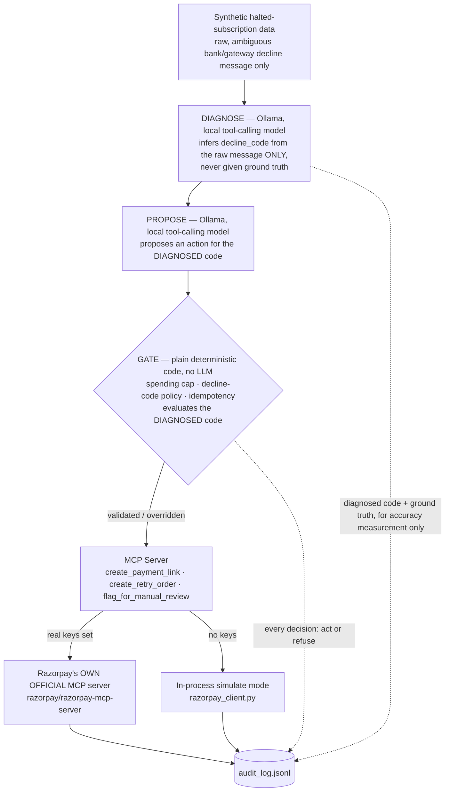

# Recoup

[](https://github.com/Ganesh-0509/razorpay-subscription-recovery-agent/actions/workflows/tests.yml)
[](LICENSE)

**Razorpay AI Buildathon — Track 3, AI Revenue Recovery**

A bounded, gated, audited agent that picks up exactly where Razorpay's own
systems give up on a payment — across all three named categories: a halted
subscription, an abandoned checkout, and an overdue B2B receivable. It
detects revenue at risk, decides the right recovery intervention, and
executes it with a measured ₹ recovered, stopping rules, and a full audit
trail. Also a small, honest rebuild of the pattern behind Razorpay's own
Agent Studio, built to prove the architecture, not to compete with the
product.

---

## Table of Contents

1. [The Problem](#1-the-problem)
2. [What This Agent Does](#2-what-this-agent-does)
3. [How This Compares to Razorpay's Own Agent Studio](#3-how-this-compares-to-razorpays-own-agent-studio)
4. [Results, Verified Against Raw Logs](#4-results-verified-against-raw-logs)
5. [Visual Proof (No Frontend Needed)](#5-visual-proof-no-frontend-needed)
6. [Known Limitations](#6-known-limitations)
7. [Setup](#7-setup)
8. [Running It](#8-running-it)
9. [Testing](#9-testing)
10. [Stretch Goals](#10-stretch-goals)
11. [What Broke During Development](#11-what-broke-during-development)
12. [Further Reading](#12-further-reading)

---

## 1. The Problem

Razorpay auto-retries a failed recurring payment 3 times over 3 days
(T+3). If all 3 fail, the subscription moves to a `halted` state and
**nothing tries again automatically.** That gap — real, documented, and
specific to Razorpay's own product behavior — is what this agent fills:
it looks at subscriptions Razorpay's own system already gave up on, and
decides, case by case, whether anything can still be done.

## 2. What This Agent Does



**Diagnosis is a real, separate stage, not a given input.** `diagnose.py`
infers `decline_code` from a raw, human/bank-style decline message via a
real Ollama tool call — it's never given the ground-truth code, and
everything downstream (the action-proposal prompt, the gate) acts on the
*diagnosed* code, not the true one. A wrong diagnosis therefore has real
consequences: the gate looks up the wrong policy row. See [§6](#6-known-limitations)
for measured accuracy and exactly what it does and doesn't cover.

**The gate is the load-bearing safety design.** The LLM only ever
*proposes* a structured decision through one tool call — it never
directly calls a money-moving tool. A separate, deterministic layer
checks every proposal against a fixed decline-code policy table and hard
spending caps before anything reaches Razorpay, and overrides the LLM
whenever it's wrong ([§4](#4-results-verified-against-raw-logs) has exactly
how often, and why that number is the point, not a flaw). It also enforces
two **compliant-escalation stopping rules** ("compliant" = bounded and
attempt-capped, not integrated with real regimes like TRAI/DND or RBI's
e-mandate window — see [§6](#6-known-limitations)): a subscription is
handed to a human instead of nudged again once it has **3 prior real
recovery attempts across any previous run**, or once it's been **halted
12+ days** and judged too cold for an automated nudge. Both proven by
dedicated unit tests (`BUILD_LOG.md` §12).

When real test-mode keys are set, the two money-moving tools route
through **Razorpay's own official MCP server**
(github.com/razorpay/razorpay-mcp-server) instead of a hand-rolled SDK
wrapper — verified live, not just implemented ([§5](#5-visual-proof--no-frontend-needed)).

**The policy is one editable config file, not a black box.** A merchant
changes how a decline code is handled by editing
[`config/decline_policy.json`](config/decline_policy.json) — no
retraining, no redeploy:

```diff
   "card_expired": {
     "description": "Customer's card has passed its expiration date",
     "source": "customer",
-    "allowed_action": "payment_link_nudge",
+    "allowed_action": "immediate_retry",
     "simulated_success_rate": 0.35
   },
```

A typo here fails loudly at startup, naming the exact bad code and field
(`test_config_typo_in_allowed_action_fails_loudly`), instead of silently
enforcing a broken policy with total confidence.

## 3. How This Compares to Razorpay's Own Agent Studio

Razorpay's Agent Studio already ships a production Subscription Recovery
Agent — this project picked the exact same problem on purpose, not to
compete with it, but to prove the same proposal/execution-separation and
audit-trail pattern from first principles. Full reasoning in
`BUILD_LOG.md` §1.1.

| | Their Subscription Recovery Agent | This project |
|---|---|---|
| Recovery mechanism | Voice call to the subscriber (ElevenLabs) | Payment link / automated retry |
| Guardrail logic | Internal certification process (closed) | One human-readable, validated JSON config |
| Audit trail | Hosted dashboard summary ("what/when") | Raw per-decision JSONL — LLM reasoning + gate override reasoning both logged |
| Access | Sales-assisted early access (Typeform) | Runs today, $0, personal test-mode account |
| **Test coverage** | Not public | **206 automated tests, CI-verified on every push** |
| **Domain scope** | Separate named agent per use case | **One gate/policy pattern reused across all 4 domains** — subscriptions, one-time payments, checkout abandonment, and overdue receivables — plus a dispatcher that routes a single mixed batch to all four ([§10](#10-stretch-goals), `INTEGRATED_RESULTS.md`) |
| **Model accuracy, published** | Not public | **Published in full** — exact match rate, confusion patterns, and prompt fixes ([`METRICS.md`](METRICS.md)) |
| **Real-integration proof** | N/A (their own product) | **Verifiable independently** — real Razorpay test-mode object IDs anyone can look up ([§5](#5-visual-proof--no-frontend-needed)) |

The point of this table isn't "we beat Razorpay's production team in a
week" — it's that everything on the right is a **real, checkable
artifact**, not a claim.

## 4. Results, Verified Against Raw Logs

Every number below is recomputed directly from `logs/audit_log.jsonl` —
full derivation in [`METRICS.md`](METRICS.md).

| Metric | Value |
|---|---|
| Halted subscriptions processed | 150/150 |
| Actions executed (retries/nudges the gate let through) | 104/150 |
| Simulated recovered amount | ₹41,819.81 of ₹1,50,729.35 total |
| **LLM proposal match rate** | **98%** (147/150) — up from ~13%, 54%, 78% across 3 real prompt fixes |
| LLM proposals the gate had to override | **2%** (3/150) — down from 87% on the first run |
| Escalated to manual review (compliant-escalation rules) | 36/150 — 32 via the stale-halt threshold, 4 via the cross-run attempt cap (this now fires for real, since `audit_log.jsonl` has accumulated genuine multi-run history across this project's development) |
| Hard-blocked by gate (cap/duplicate) | 0 in the main pipeline; 1 real block in the Route demo |
| Real Razorpay objects created (real MCP server, real test keys) | 34 (`REAL_MCP_RESULTS.md` + `RESULTS_ONETIME.md`) |

The override rate isn't a bug to be embarrassed about — it's the measured
proof a supervisor layer is necessary, and that stays true even as it
shrinks. Three rounds of real prompt-bug diagnosis (`METRICS.md` §2) took
it from 87% to 46% to 22% and down from there — including one fix whose
own side effects broke 3 other decline codes, found and then fixed in the
next round, documented honestly rather than smoothed over. And the gate
doesn't retire at a low override rate: the spending cap and idempotency
checks are properties of the money-moving action itself, not of the
model's judgment.

**One honest caveat, tested rather than left as a gap:** the 150-record
match rate is really **15 unique scenarios**, not 150 — `decline_description`
is a fixed string per code at `temperature: 0`, so every record sharing a
code gets an identical proposal every time. Tested two ways instead:

- **16 clean paraphrases**, sharing no wording with the fixed catalog:
  **16/16 (100%)** matched policy (`METRICS.md` §2.4).
- **16 deliberately adversarial descriptions** — real payments jargon
  (`3DS`, `CNP`, `acquirer`): **15/16 (93.8%)**, with one real miss — a
  fraud case read as customer-actionable despite the description
  containing the word "risk" twice. **This miss never reaches Razorpay
  either way:** the gate looks up the correct action from the actual
  `decline_code`, never from the LLM's reading of any description — the
  clearest concrete proof in the whole project for why the LLM's
  proposal never executes directly (`METRICS.md` §2.5).

## 5. Visual Proof (No Frontend Needed)

This project is intentionally backend-only — the rubric asks for a
public repo, a 5-minute pitch video, and an architecture explanation, not
a hosted product. Here's what to show instead of a UI:

1. **`REPORT.html`** — a self-contained, offline static page built from
   the audit log (stat tiles, an override-rate figure, per-decline-code
   bars, a filterable table). Regenerate any time with
   `python generate_report.py`.
2. **`POLICY_DASHBOARD.html`** — the merchant-facing view: every decline
   code in plain English, with source/action filters — no digging through
   a `.py` file to know what `payment_link_nudge` does. Deliberately
   **read-only** — see [§6](#6-known-limitations) for why. Regenerate with
   `python generate_policy_dashboard.py`.
3. **The architecture diagram in [§2](#2-what-this-agent-does)** — renders
   natively wherever this README is viewed (GitHub, GitLab).
4. **The Razorpay dashboard itself, showing real objects** — the
   strongest, independently-verifiable proof available. Log into
   `dashboard.razorpay.com` in **Test Mode**, search any ID from
   [`REAL_MCP_RESULTS.md`](REAL_MCP_RESULTS.md) (e.g.
   `order_TVya2xkz293ced`). It exists in a real Razorpay account, created
   by this code — not just claimed in a log file.
5. **The GitHub Actions tab** — green checkmarks across commit history.
6. **A terminal recording of `--inject-failure`** — run
   `python agent.py --inject-failure llm_parse_failure` on camera. A real
   code path triggering live, not a historical log line read aloud.
7. **The commit history itself** — real incremental commits, showing the
   project was built step by step, not generated in one shot.

## 6. Known Limitations

Full reasoning and every fix's history live in `BUILD_LOG.md`; this is
the scannable version.

- **Detection and diagnosis are real, separate, fallible stages — but not
  wired into the flagship 150-record batch.** `detect.py` (100% on a
  30-record mixed pool, `DETECTION_DEMO_RESULTS.md`) and `diagnose.py`
  (90% on 30 records, `DIAGNOSIS_DEMO_RESULTS.md`) are both proven live
  against the real local Ollama server, each with a dedicated test
  proving a wrong call has a real downstream consequence — but
  `data/halted_subscriptions.json` still has no detection signal, and
  every record in it is still processed unconditionally. Reproducing
  Razorpay's real multi-day halt cycle live is the underlying constraint
  neither stage removes.
- **Checkout abandonment and overdue receivables are standalone domains,
  not merged into one decision engine.** Each has its own diagnosis
  stage, policy table, and gate (`abandonment_gate.py`,
  `receivables_gate.py` — deliberately not `gate.py`'s `Gate.evaluate()`,
  since that method's signature is built around a `decline_code` lookup
  neither domain has). `integrated_pipeline.py` dispatches a single mixed
  batch to the right domain-specific logic automatically, but that's
  routing, not a merged gate — each domain's policy and audit trail stay
  separate on purpose. The live mixed-batch demo is 16 records (4/domain),
  scaled down from an originally planned 60 by this machine's local
  Ollama inference speed, disclosed rather than mocked
  (`INTEGRATED_RESULTS.md`, `BUILD_LOG.md` §18).
- **The policy dashboard is read-only by design, not a missing feature.**
  A live editable version needs real access control and an audit trail on
  the edit itself — neither of which this project has built, and neither
  of which is safe to fake. `config/decline_policy.json`'s own git history
  already gives a real, free audit trail; a merchant still edits the file
  directly.
- **"Compliant escalation" means bounded and attempt-capped, not
  integrated with real regulatory regimes.** No TRAI/DND consent
  modeling, no RBI e-mandate pre-debit notification window — stated
  explicitly as a scope boundary, not an oversight.
- **The MCP tools now carry their own independent spending cap**
  (`_enforce_tool_level_cap()` in `mcp_server.py`), so a caller that
  skipped the gate can't overspend or double-act through the tools
  directly — proven by `tests/test_mcp_server_guard.py`. This is still
  narrower than the full gate: the tools never receive a `decline_code`,
  so the policy lookup itself only lives in `gate.py`.
- **Idempotency is proven at batch scale, not just in isolation** —
  `tests/test_idempotency_integration.py` runs two records sharing one
  `subscription_id` through the same real batch sequence `agent.py` uses,
  confirming the second is hard-blocked, not just unit-tested alone.
- **A real silent-failure bug was found and fixed twice.** `write_results()`
  only ever checked gate approval, never whether the underlying Razorpay
  API call actually succeeded — so a real API failure could get counted
  as "executed." Found once, fixed procedurally; found again during a
  final pre-submission audit because the first fix wasn't durable. Full,
  undiluted story — including the exact numbers each time — in
  `BUILD_LOG.md` §12 and §19.

Full project docs: [`BUILD_LOG.md`](BUILD_LOG.md) (problem statement, every
technical decision with reasoning, architecture, protocol, gate design,
real results — the single source of truth) ·
[`EASY_EXPLAINER.md`](EASY_EXPLAINER.md) (plain-language walkthrough, one
running example throughout) ·
[`GLOSSARY.md`](GLOSSARY.md) (every term used, defined) ·
[`METRICS.md`](METRICS.md) (every number verified directly against the raw
audit log, including the LLM's exact error patterns)

## 7. Setup

```bash
python -m venv .venv
.venv\Scripts\pip install -r requirements.txt

# Optional: real Razorpay test-mode keys (free, no KYC, from dashboard.razorpay.com)
# If skipped, everything runs in simulate mode automatically.
copy .env.example .env
# edit .env with your rzp_test_ keys

# Requires Ollama running locally with a tool-calling model pulled, e.g.:
ollama pull llama3.1:8b
```

## 8. Running It

```bash
cd src
python generate_data.py   # writes data/halted_subscriptions.json (synthetic)
python agent.py            # runs the full pipeline, writes RESULTS.md and logs/audit_log.jsonl

# Demo mode: force the "one failure handled gracefully" moment on the
# first record live, instead of pointing at a historical log line -
# python agent.py --inject-failure llm_parse_failure
# python agent.py --inject-failure llm_invalid_action

python generate_report.py  # writes REPORT.html - one static, offline page
                            # built from audit_log.jsonl (no server, no
                            # framework, no CDN), watchable in 10 seconds
                            # instead of scrolled through as raw JSONL

python generate_policy_dashboard.py  # writes POLICY_DASHBOARD.html - the
                            # merchant-facing, plain-English, filterable
                            # view of config/decline_policy.json (§5, §6)
```

## 9. Testing

```bash
python -m pytest tests/ -v   # 206 tests, no Ollama server or real keys needed
```

The gate has unit tests independent of the LLM — it must be correct even
when the model isn't, since that's the entire point of having it. The
decline-code policy config is tested separately: if it's wrong (or a
merchant typos an edit), the gate must refuse to load it rather than
enforce the wrong thing with total confidence. `tests/test_ollama_client.py`
mocks the Ollama HTTP calls directly to exercise the failure paths that
actually happened during development — no tool call, malformed arguments,
a transient failure that retries and recovers, and retries fully
exhausted without crashing the caller.

## 10. Stretch Goals

**Generalizing beyond subscriptions:**

```bash
cd src
python generate_data_onetime.py   # writes data/failed_onetime_payments.json
python agent_onetime.py            # writes RESULTS_ONETIME.md and logs/audit_log_onetime.jsonl
```

Proves the gate/policy/audit-log pattern isn't subscription-specific: the
exact same `Gate`, `config/decline_policy.json`, and MCP tools handle
failed one-time payments too, with only the LLM's situation description
changed. `gate.py` needed zero changes. Full reasoning in `BUILD_LOG.md` §13.

**Route (split settlement):**

```bash
cd src
python route_demo.py   # writes ROUTE_RESULTS.md
```

A referral partner earns a percentage of a recovered subscription via a
Razorpay Route transfer, split at order-creation time. Also demonstrates
the same spending-cap value blocking an oversized transfer, independently,
in two places: `route_demo.py`'s own check and `mcp_server.py`'s
`_enforce_tool_level_cap()`.

**Checkout abandonment:**

```bash
cd src
python generate_checkout_abandonment_data.py   # writes data/abandoned_checkouts.json
python checkout_abandonment_agent.py 30        # writes CHECKOUT_ABANDONMENT_RESULTS.md
```

A customer who started checkout but never completed a payment attempt —
no `decline_code` exists for this, so it's a genuinely different data
model, with its own diagnosis stage, policy table, and gate. Real,
measured numbers in `CHECKOUT_ABANDONMENT_RESULTS.md`.

**Overdue receivables:**

```bash
cd src
python generate_receivables_data.py   # writes data/overdue_invoices.json
python receivables_agent.py 30        # writes RECEIVABLES_RESULTS.md
```

A B2B invoice unpaid past its due date — revolves around an aging clock
plus payment/reminder history, not a decline code or checkout funnel. Own
diagnosis stage, policy table, and gate with two escalation rules (a
reminder-count cap, a legal-review staleness threshold). Real, measured
numbers in `RECEIVABLES_RESULTS.md`.

**Cost: $0.** Razorpay test mode needs no KYC, no payment method, no live
keys. The agent model runs locally via Ollama, not a paid API.

## 11. What Broke During Development

Documented in full in `BUILD_LOG.md` §3.6/§12/§19, kept in because it's real:

1. The first gate conflated "the LLM's proposal was denied" with "no
   action should be taken" — every policy mismatch silently skipped
   execution instead of running the corrected action. Caught by a
   5-record smoke test, fixed by splitting the decision into
   `llm_matched_policy` (a metric on the model) and `execute` (whether
   the corrected action actually runs).
2. The first full 150-record run crashed on a transient Ollama 500 —
   traced to the model reloading from disk on every call (~20s each)
   instead of staying resident. Fixed with `keep_alive`, retry/backoff,
   and a per-record try/except so one bad record can't take down the batch.
3. The batch run got killed by its environment mid-run — four separate
   times across development, including twice during a final
   pre-submission memory-constrained run today. The pipeline is
   checkpointed and resumable (`logs/results_checkpoint.jsonl`) —
   confirmed working every time, including a real kill at 124/150 during
   an earlier accuracy re-run and two more kills today at 58/150 and
   61/150, all resumed cleanly with zero lost work.
4. An independent audit caught that the LLM's ~87% policy-override rate
   was partly self-inflicted: the tool schema gave the model an action
   enum with no per-value explanation, so it read `no_action_fraud` as a
   generic "no action needed" bucket. Fixed by spelling out exactly what
   each action means — brought the rate to 46%.
5. A second, deeper diagnosis found two more systematic biases behind
   that 46% and fixed them with an ordered decision rule — down to 22%,
   but introducing a new regression on 3 codes, documented rather than
   hidden.
6. A third fix targeted that regression directly. Final, fully clean
   150-record re-run (redone once more the day of submission after
   catching a real-API silent-failure bug — `BUILD_LOG.md` §19): **98%
   match, 2% override rate.**

## 12. Further Reading

| Doc | What's in it |
|---|---|
| [`BUILD_LOG.md`](BUILD_LOG.md) | The single source of truth — problem statement, every technical decision with reasoning, architecture, protocol, gate design, full results |
| [`EASY_EXPLAINER.md`](EASY_EXPLAINER.md) | Plain-language walkthrough, one running example throughout, no jargon |
| [`GLOSSARY.md`](GLOSSARY.md) | Every acronym/term used anywhere, expanded |
| [`METRICS.md`](METRICS.md) | Every headline number, re-derived from raw logs, including the model's exact error patterns |
| [`RESULTS.md`](RESULTS.md) / [`RESULTS_ONETIME.md`](RESULTS_ONETIME.md) / [`ROUTE_RESULTS.md`](ROUTE_RESULTS.md) | Auto-generated per-run output |
| [`REAL_MCP_RESULTS.md`](REAL_MCP_RESULTS.md) | Real Razorpay test-mode objects created via the official MCP server |
